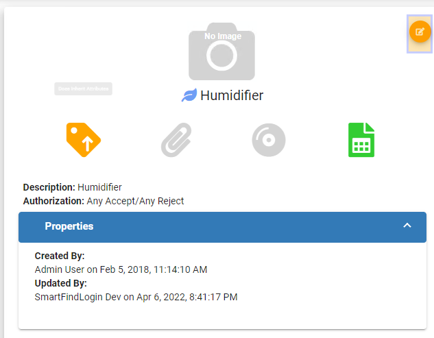
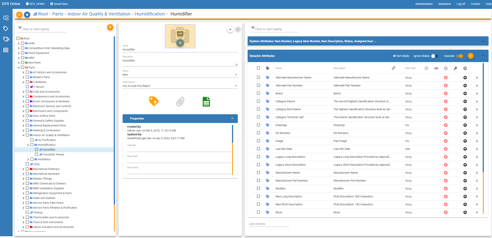
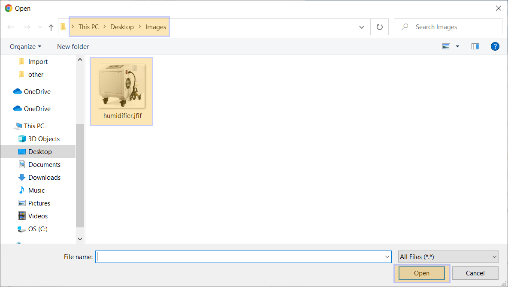
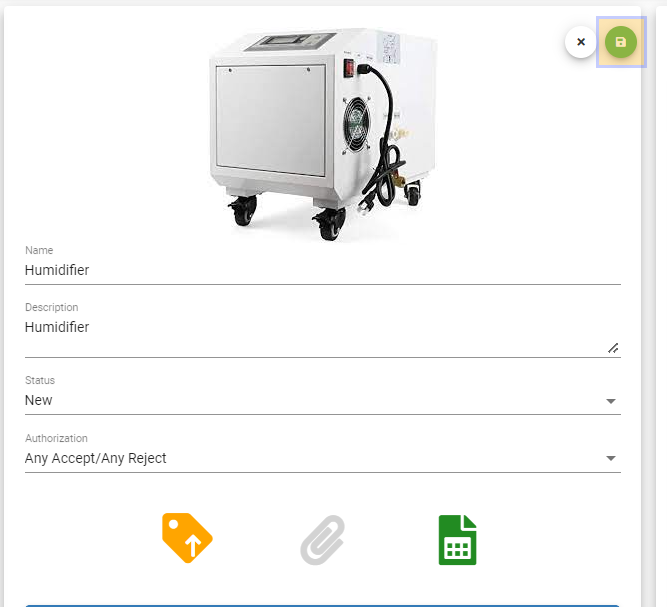

Add\_Category\_Attachments - Design For Retrieval (DFR) Help

# Add Category Attachments

 

Navigate to SmartClass and click the orange button called "Category Tree" 

 

 

Now you can click the orange "thumbtack" button to pin the tree on the page. 

 

Then drill down to the category that you would like to add an image to.

 

 

Click the orange edit button on your desired category.

 

 

Hover your mouse over the grey camera that says "No Image" and a blue button with a plus will appear that says "add". Click on this button.

 

 

Now in your file explorer, navigate to where your image is saved. Click on the image you would like to add and then click Open.

 

 

 

Now click the green Save button and you have successfully added a category image. 

 

 

