Add\_Category\_Images\_Bulk\_Load - Design For Retrieval (DFR) Help

# Add Category Images (Bulk Load through Import Mangager)

 

1. An Excel file must be set up first before the import process can begin.

It must look like the attached list. This includes:

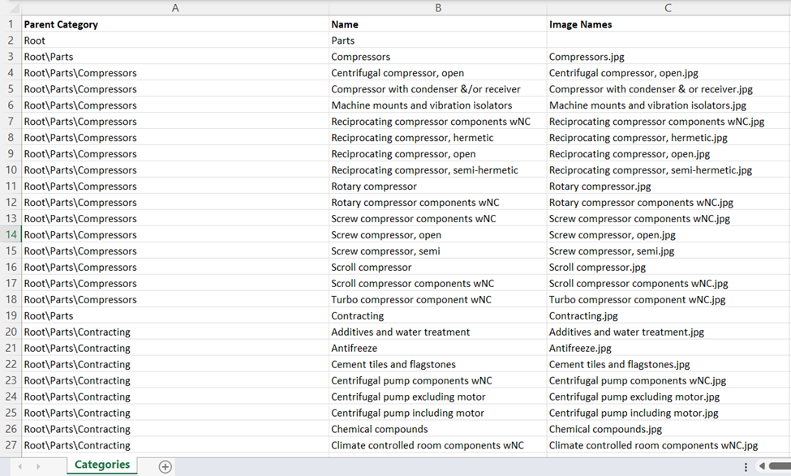

 

The column headings in the Excel file you create must be Parent Category (CDS PIM category path where you would like your image), Name (the category name), and the Image Name (exact file image name).

The worksheet itself must be named "Categories"

All of the images that you are planning to bulk load must be saved on your computer in a common folder. 

The image can be in JPG or PNG format.

 

2. Before starting this process, the engineering team must configure the system.

 

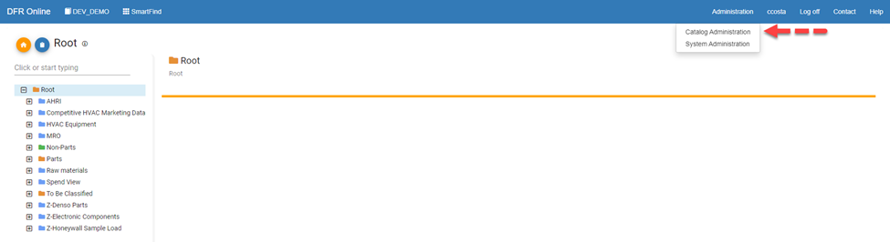

 

Click on Options Management

 

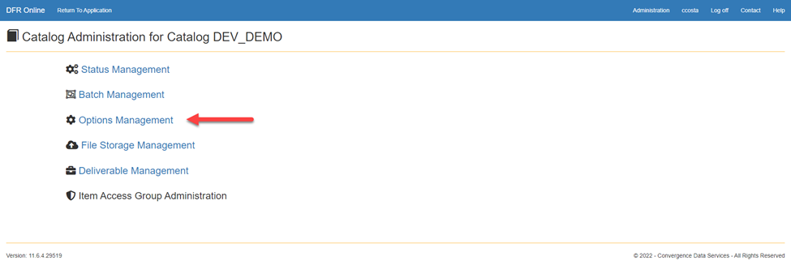

 

Click on Structure Options

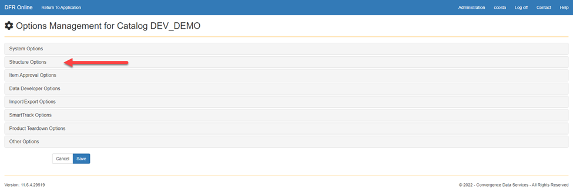

 

 

Category image Storage Configuration must completed. Without it , the system image imports will fail.

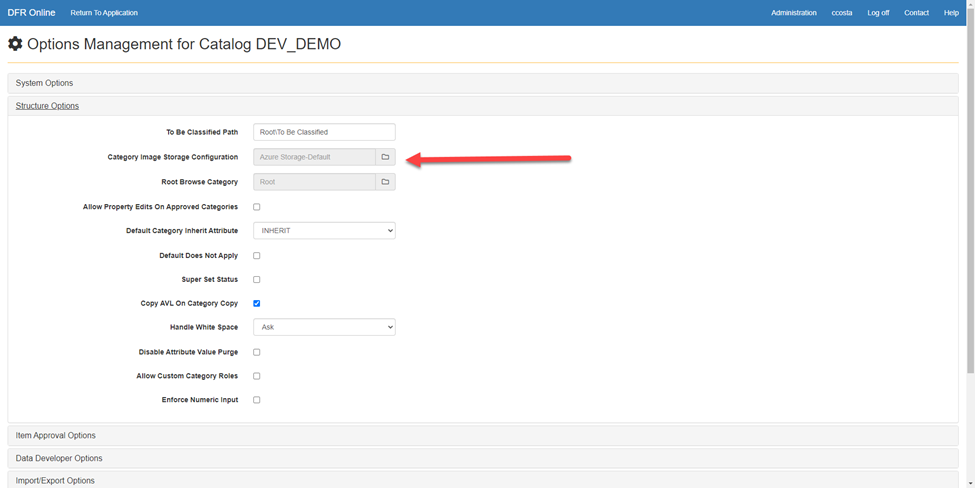

 

3. Locate the Import Manager and select Classification Data in your CDS PIM Thick Client

 

 

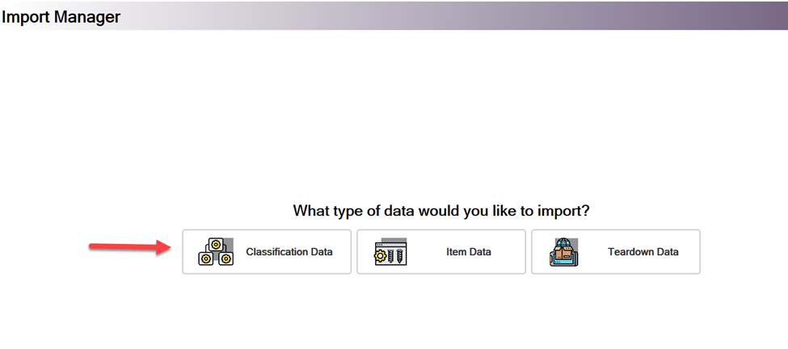

 

Browse for the Excel File you have just created and select it on the first window.

 

Import type choose "File".

 

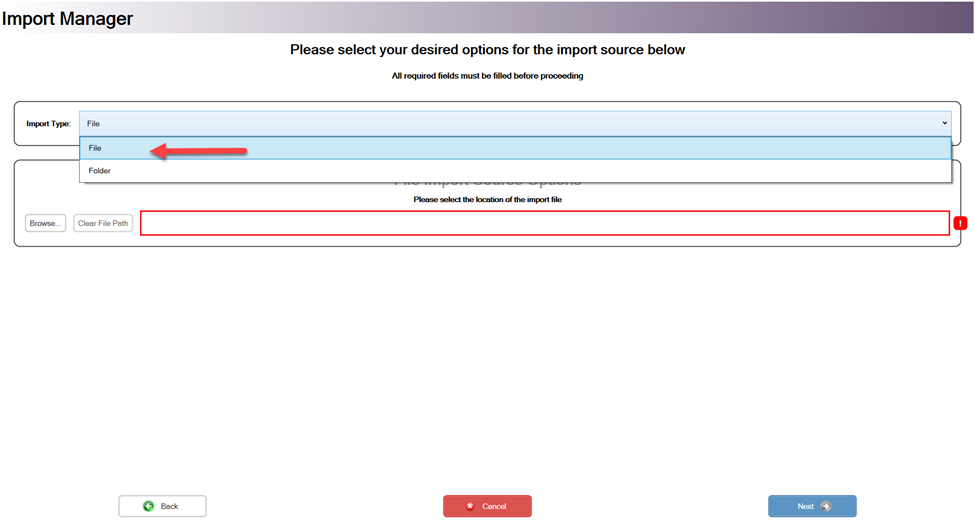

 

Select Next on the bottom right of the screen.

 

Select Excel as the Import Format

 

 

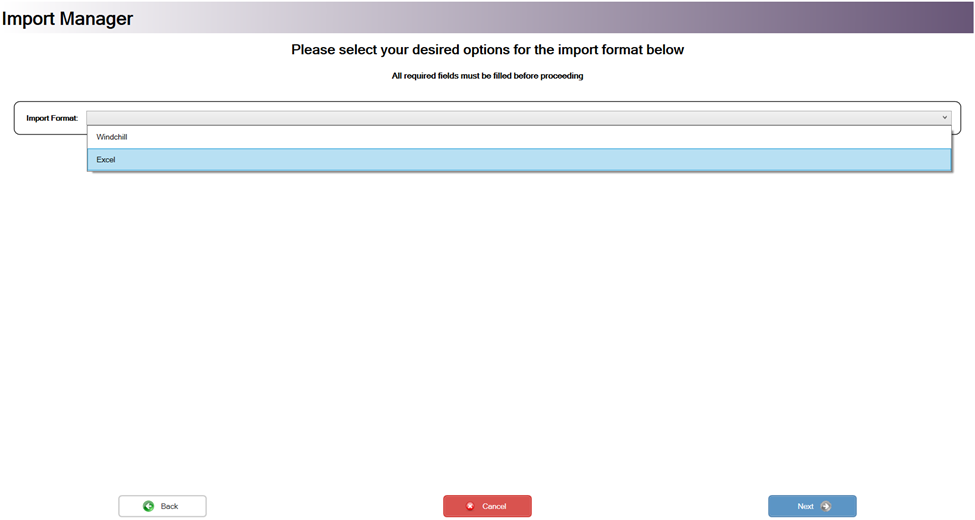

 

 

 

Now check the box for Import Category Data and uncheck all other boxes.

 

 

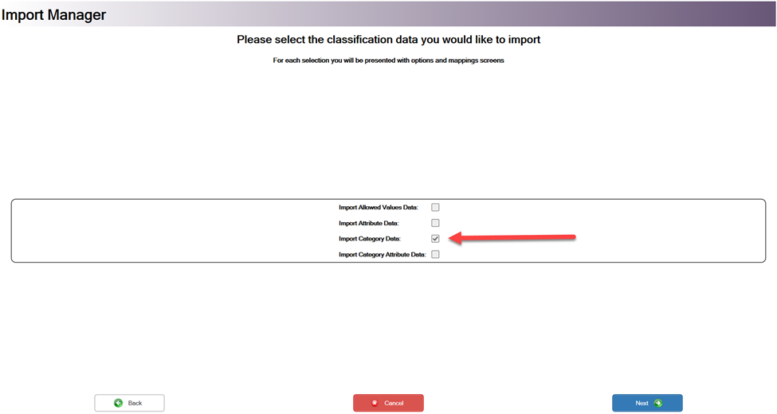

 

 

If you are creating new categories then you need to set the operation to "Create". If you are adding images to existing categories then change the operation to "Update". If you are doing some of each at the same time then select "Create or Update". 

 

 

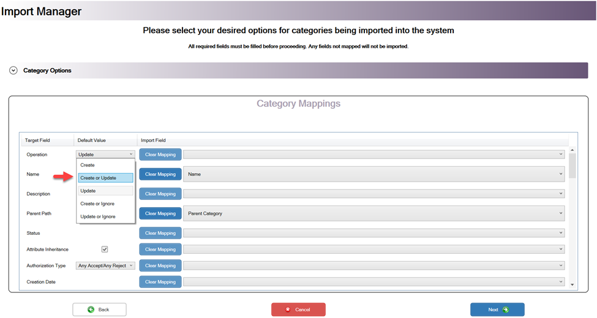

 

 

Drop down the Category Options menu at the top of the screen. Select the three dots button and choose the folder that your images are stored on your computer.  

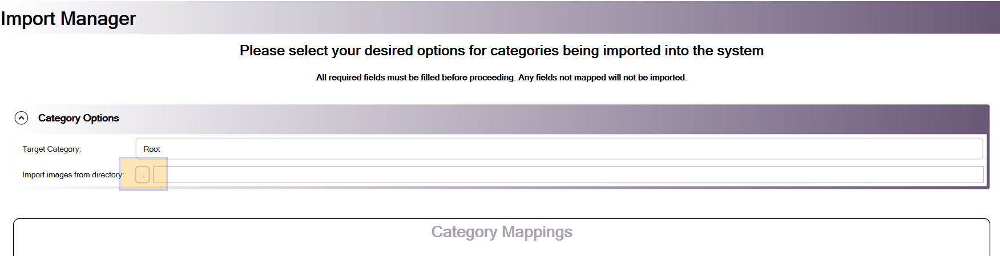

 

 

You must map “Category Image” to “Image Names”

 

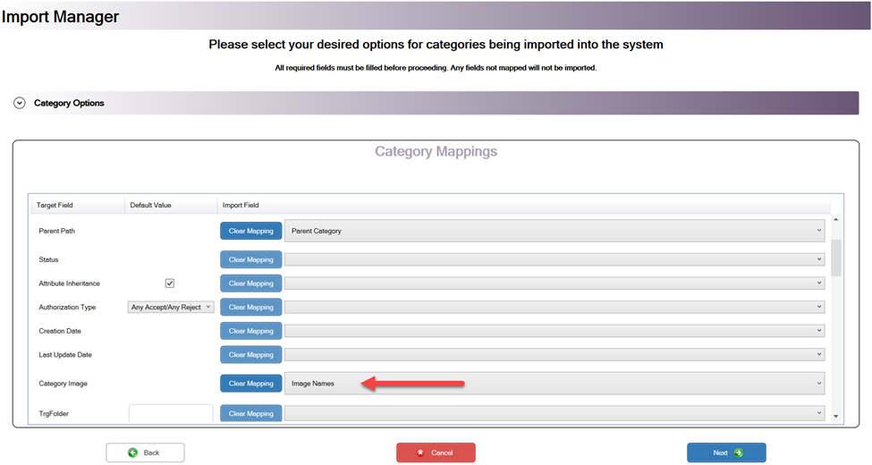

 

Now you can click next, validate, and if there are no issues you can import the data into CDS PIM.

 

To make sure the image upload worked, go to CDS PIM online and see if there are images for categories in SmartFind or SmartClass.

