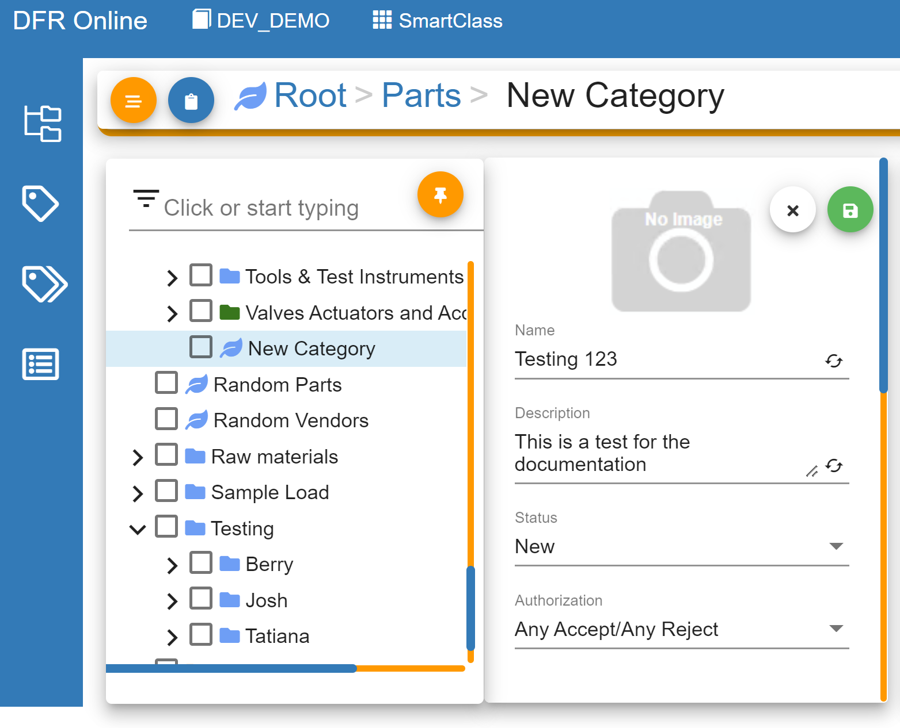

# Add New Parts Category

Add\_New\_Parts\_Category - Design For Retrieval (DFR) Help

## Add New Parts Category

Adding new categories is a very simple process. The user is able to add parent or child categories all throughout the structure.

&#x20;

&#x20;

&#x20;

&#x20;

In classification, locate the parent category that your new category will exist under.

This can be from a Root level or anywhere below that.&#x20;

&#x20;

In this example, the new category will be built off of "Parts."

Select the three dots on the right side of "Parts".

Select Create.

Select Item Category.

.png)

&#x20;

Convergence PIM Online will now prompt you to create a name and description for your new category. Once you enter a name,

please click the green save button in the top right of the New Category window.  You can then change the description

or properties of the category you just created by clicking the orange edit button on the top right.

&#x20;

For more information on editing categories, please follow one of the pages below:

[Edit Category Properties](add_new_parts_category.md)

[Edit Category Details](add_new_parts_category.md)

&#x20;

Adding child categories is just as simple as the parent.&#x20;

Follow the same steps as above, but from the category level itself. This will build child categories directly under the chosen parent category.

&#x20;
