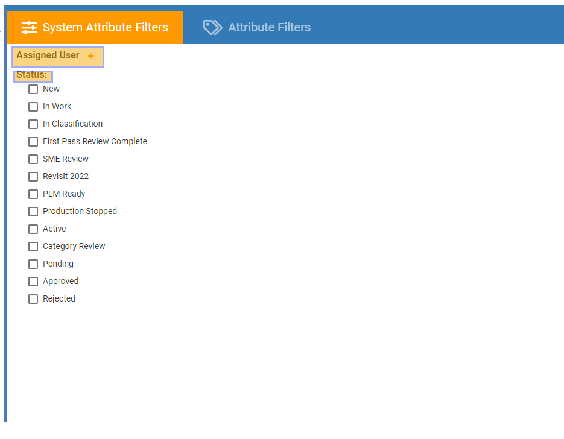
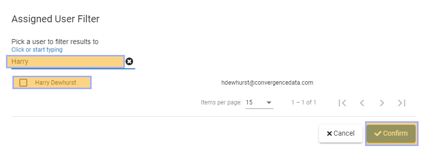
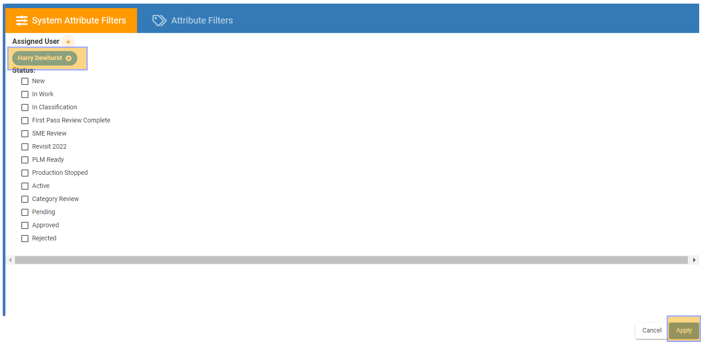
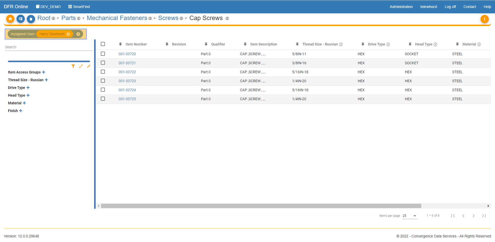

# Assigned User Filtering

Assigned\_User\_Filtering - Design For Retrieval (DFR) Help

## Assigned User Filtering

&#x20;

Navigate to SmartFind and drill into a category where you would like to view and access parts.&#x20;

&#x20;

Click on the Funnel icon highlighted below and this will take you to SmartFind Advanced Filtering.&#x20;

&#x20;

&#x20;

&#x20;

The Advanced Filtering Menu comes up and you can choose, System Attribute Filters or Attribute Filters. Let's start with system attribute filters, under this set of filters you can filter by assigned user or by item status.&#x20;

&#x20;

&#x20;

Click the plus next to the assigned user and it will bring up this menu where you can search for parts that are assigned to a specific user.&#x20;

&#x20;

Type the name of the user and you can then pick the user you would like, check the box next to their name and click confirm.&#x20;

&#x20;

You can now see the Assigned User Filter has been accepted, you now need to click "Apply" in the bottom right to apply the filter and view your results.&#x20;

&#x20;

&#x20;

Once you click confirm you can see all of the items that are assigned to the user.&#x20;

&#x20;

&#x20;

&#x20;

&#x20;

&#x20;

&#x20;

&#x20;

&#x20;

&#x20;

&#x20;

&#x20;

&#x20;

&#x20;

&#x20;

&#x20;

&#x20;

&#x20;

&#x20;

&#x20;

&#x20;

&#x20;

&#x20;

&#x20;
