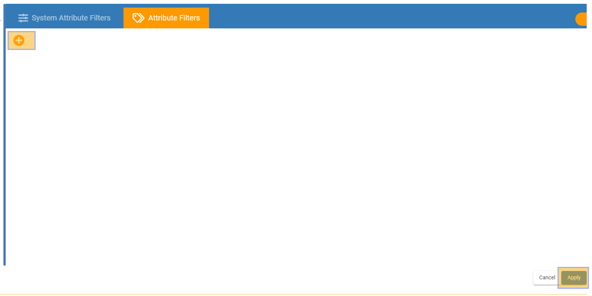
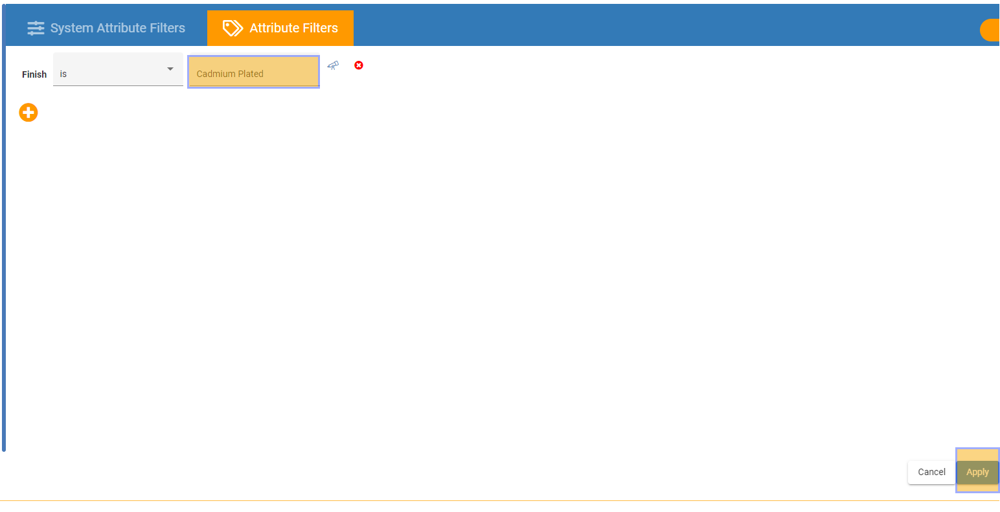
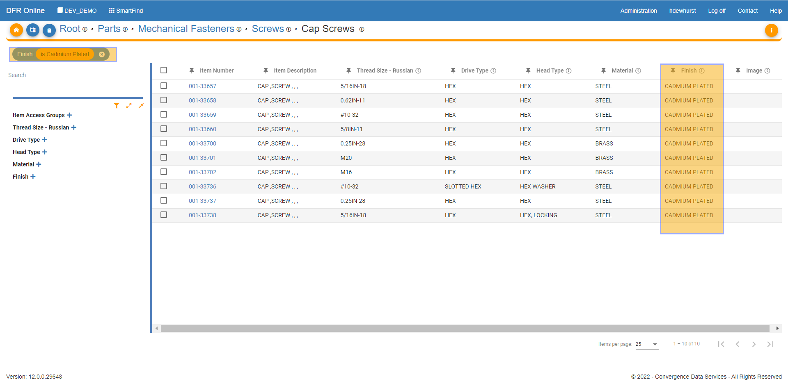

# Attribute Filtering

Attribute\_Filtering - Design For Retrieval (DFR) Help

## Attribute Filtering

Navigate to SmartFind and drill into a category where you would like to view and access parts.&#x20;

&#x20;

Click on the Funnel icon highlighted below and this will take you to SmartFind Advanced Filtering.&#x20;

&#x20;

&#x20;

&#x20;

The Advanced Filtering Menu comes up and you can choose, System Attribute Filters or Attribute Filters. Let's click the Attribute Filters button on the top.

&#x20;

Click the plus sign to add an attribute filter.&#x20;

&#x20;

&#x20;

&#x20;

Click the drop down menu to choose which operator you would like to use.&#x20;

Since I am filtering on an attribute with a String data type I will be using the "is" operator because you cannot use logical operators on string values.&#x20;

&#x20;

If you are filtering on a numeric attribute you can use the logical operators that are offered in SmartFind's advanced filtering.&#x20;

&#x20;

Type in what you would like to filter by in the box to the right of the operator box, and click apply.&#x20;

&#x20;

&#x20;

Now the list of items will be filtered by if the finish is cadmium plated. The current active filters show up on the top of the screen in the "chip" icons, highlighted below.&#x20;

&#x20;

&#x20;

&#x20;

You can add as many filter "chips" as you would like and they will add on to one another to refine your filtering.

&#x20;

&#x20;

&#x20;
