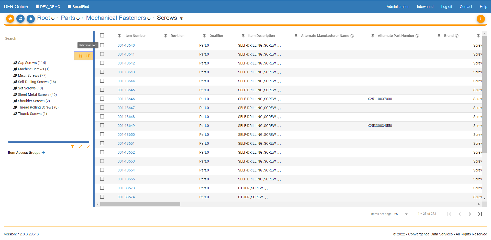

Category\_Filtering - Design For Retrieval (DFR) Help

# Category Filtering

 

You can filter into categories in SmartFind if you are not in a leaf category. Browse to a parent category. 

 

In the category tree on the left, you can select the child categories to the parent category you are in. 

 

You can also sort the children's categories by relevance or by alphabetical order. You can do this by clicking the highlighted "Alpha Sort" or " Relevance Sort" icons. You will see the category tree change as you click the icons. 

 

