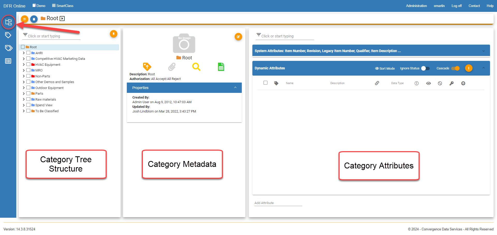

Classification - Design For Retrieval (DFR) Help

# Classification Management

The Classification page allows the user to perform most of the changes to the structure/schema, category attributes, and more.

Click on the folders icon 

 to go to the Classification page. 

 

 

The page is divided into three different sections:

- **Category Tree Structure**- Folder structure displaying all categories and a search/filter bar
- **Category Metadata**- Includes metadata for category updates, a photo if one is assigned to the category, a link to the items in the category (magnifying glass icon), and more
- **Category Attributes** - Includes system attributes (global) and dynamic attributes (category-specific)

 

Click on the links below to access the following pages:

- **[Structure](#)**
	- [Navigate Classification Structure](#)
	- [Category Management](#)
		- [Copy and Paste Categories](#)
		- [Add New Categories](#)
			- [Add New Parts Categories](#)
			- [Add New File Categories](#)
		- [Edit Categories](#)
			- [Edit Category Properties](#)
			- [Edit Category Details](#)
		- [Delete Category](#)
		- [Add Category Attachments](#)
		- [Add Category Images](#)
		- [Assign Allowed Vales Lists](#)
- **[Attributes](#)**
	- [Add New Attributes](#)
	- [Add Existing Attributes](#)
	- [Remove Attributes](#)
	- [Manage Attributes](#)
	- [Edit Attribute Details](#)
	- [Sort Attributes](#)
	- [Filter Attributes](#)
	- [Set Attributes as Key, Required, DNA, and Read Only](#)
	- [System Attributes](#)
- **[Statuses](#)**
	- [Category Statuses](#)
	- [Attribute Statuses](#)

