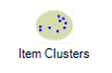
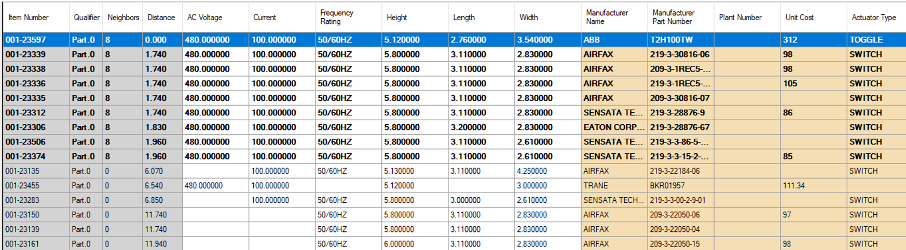
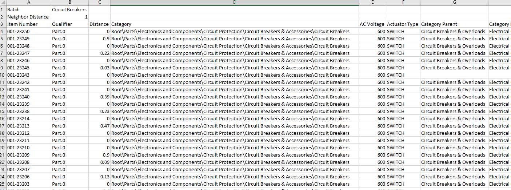

Cluster\_Tool - Design For Retrieval (DFR) Help

# Cluster Tool Overview

The Convergence PIM clustering tool makes it easy to group parts that are similar based on their attribute characteristics.  

Many companies like to cluster parts by category to look for opportunities to rationalize parts and standardize on certain features.  

  

The clusters tool can help expose the attribute characteristics that are driving differentiation/proliferation in a category e.g. finish for screws.  

Another valuable aspect to clustering is when you can compare similar parts and their associated pricing. Many times larger companies are buying similar parts from different vendors and don’t realize they may be getting charged entirely different prices. This typically happens when different divisions of a company are not working together or sharing a single parts database.  

  

Clustering is an iterative process, users can try weighting different attributes to analyze the data in different ways to expose the most valuable clusters they may be looking for. Once you are happy with your cluster results - users have the ability to either share a cluster or export a cluster and distribute to others.

 

 

<iframe src="https://www.youtube.com/embed/rneju9QxQfI/?wmode=transparent" width="560" height="315" frameborder="0" allowfullscreen></iframe>

 

  

 

## Open the Item Cluster Tool

  

In order to use the Item Cluster tool, first you must be logged into **Convergence PIM****Thick Client**.

In the **Applications** toolbar, select the **Item Cluster** icon to open the **Item Cluster Module.**

     

 

 

Once the module has opened, it is no longer necessary to have a batch created already. 

If you would like to select a batch, that function does still exist: simply select "Batch" and choose your working batch.

Navigate to the desired category using the structure search on the left side of the page. 

Any key attributes will be automatically weighted on the top of the page. 

 

     .png)

## Set the Baseline Data

  

If this is your first time working with this particular batch in the clustering tool. There are a few items you will need to do to set the data up correctly, if your scope is outside of the key attributes only. Key attributes will automatically be set upon entering a category.  

First you will want to select all the items in the top window, the **Attribute Grid**, by using the "**Ctrl+A**" shortcut.  

Once all the items are selected, you can set all items to a baseline of zero by right clicking and selecting "**Zero**"

This will remove any existing **Weight Factors** from the attributes, and allow you to start fresh.

 

      .png)

 

## Weighting Attributes

  

You will want to assign weights to the main attributes of the items you want to cluster on.  

One of the best ways to start is by setting the **Key Attributes** on the classification to be your weighted attributes. The key attributes are automatically selectied upon choosing a batch or category, but can be unselected at any point or have other attributes added into the cluster weighing. 

Because of how the Convergence PIM tool calculates clusters, we recommend using **Numeric** attributes, as much as possible for your key/critical weighting factors. This will allow for better clustering data. (See below for additional explanation on weighting). 

Once you have determined the attributes you will be using to determine your clusters, you can check them as "**Critical**" in the **Attribute Grid**, which will bring them to the left hand side of the **Data Grid**, on the lower half of the screen.

You can then add **weight** information to these items as well, which will help Convergence PIM to find duplicates, and near duplicate neighbors.  (See below for additional information on weighting)

 

If you decide to un-select or start over in your weighing process, simply choose "**Reset Weighting**" to start from scratch.

 

.png)

.png)

 

When working with categories that have relationship attributes, data can now be pulled into clusters (e.g. supplier pricing data) so that the user can compare the same item in a cluster with different supplier pricing, as seen below:

Pricing will be at the bottom of the attribute grid, but will be grayed out everywhere except the check box to select it. Weighting cannot be changed on this attribute but this will only ever be the case with "Pricing." 

.png)

 

## Weighting Explained

  

In the Convergence PIM Cluster tool, we use "**weight**" in order to determine duplicates and near duplicate neighbors.   

There are a number of factors that determine how we group these items, and the user has significant control over this information, by using the attribute weighting to determine importance.

  

**Weighting works as follows:**  

A user sets a **"Neighbor Distance**" before running the cluster calculation. This will determine what "**distance**" is allowed for each cluster. Lets assume a neighbor distance of 2 for this example

Next, you weight each individual attributes.   

    1) A string attribute works as a binary yes/no for this. If the items match, the weight is 0. If they don’t, it will be the assigned weight of the attribute. (1 in this example)  

    2) A Numeric field takes into account the actual difference between 2 values (Based on system default UOM), then multiplies this by the weight factor.   

        In our example the weight factor for height is 2.So if the height is .3 inches apart, this would be multiplied by 2 for a total distance of .6  

    3) the NULL WEIGHT column allows you to assign a weight to a null value. If the value is null it will automatically add this mount to the distance. By setting this number above your neighbor   

        distance, you can effectively exclude any items with nulls from your clusters.   

      

Using the above 3 factors, the Convergence PIM tool will calculate the distance of each item in relation to each other item, and assign a neighbor distance between them.   

Any items below the user defined **Neighbor Distance** will be included in the cluster of a given item (and will be shown in bold in the data grid)

 

## Data Grid Display Explanation

 

Now that we have assigned a **Neighbor Distance**, and weighted our individual attributes, we can populate the data grind by hitting the **Calculate** button

The clusters will be **automatically saved**, so if programs close unexpectedly or the user selects off of the Clusters tool for any reason, simply opening the Clusters tool again will bring the user directly back to where they were with no interruption.  

 

.png)

  

You can also set the tool to auto calculate anytime a change is made to the configuration grid by checking the **Automatic Calculation** box

 

Once the information has populated, items selected as weighted will appear in alphabetical order, in white, from the left side of the screen. Next you will see any "Critical" but non weighted items in orange. Then all other  attributes will be displayed, in alphabetical order to the right of that. 

 

In the picture below, AC Voltage, Current, Frequency Rating, Height, Length, and Width are all used as **weighted**, **critical** attributes, and appear in white. 

Manufacturer Name, Manufacturer Part Number, Plant Number, and Unit Cost are all **critical**, but not weighted. They appear first in orange.

All other attributes appear to the right of Unit Cost, in alphabetical order. Actuator Type is visible, and if you scrolled the **Data Grid** to the right, you would see all other attributes for this classification. 

 

## Sorting the Data Grid

 

Once you have calculated your clusters, the first thing you may want to do is bring the biggest clusters to the top of the **Data Grid**.  

By clicking on the column header of "**Neighbors**" you will sort the data grid, and part with the largest number of neighbors will be moved to the top. Selecting this item will bold it, and any neighbors that are within the defined **neighbor distance.** 

Once you have done this, each item will have a **neighbor distance** that relates to the currently selected item. In order to sort by the closest neighbors, you can click on the "**Distance**" column heading order to bring the smallest distance items to the top. 

 

## Identifying other clusters:

 

While you have an item selected, all of its clustered neighbors will appear in bold. If you are sorted by "**Neighbors**" you can scrolls down, and the first non-bold item will be a first item in the next largest cluster.   

If you select it, you will notice all the items "**Distance**" values will recalculate to show the distance to it, and the bold items will change to reflect this information as well.   

You may notice that even within some clusters, some items will have different numbers of neighbors, and by selecting them you will end up with a different result set. This is likely because they are on the outer bound of the main cluster, and therefore some cluster items may be outside of the predefined neighbor distance. 

 

## Modifying your clusters

 

Depending on your needs, and your reason for running cluster data, there are many different things you could be looking for. Thankfully, once you have run a cluster calculation, you don’t have to stop there.   

Once you have a set of data, you an go back up to the **Attribute Grid** and change and modify your items as much as you want. Lower/raise **weight**, change **critical** attributes and change the overall **neighbor distance**.   

Playing with these items will allow you to fine tune the data for your individual needs, and allow you to harness the power of your data.

 

Here are some tips about how to get the most out of your data in different circumstances:

- In the Attribute Grid, there is some useful data shows that can help you to better analyze your data, including the number of occurrences in the data for a given attribute, so you can get a gauge on how many nulls you may encounter.
- We show the min and max, so you can figure out the range that you are looking at and determine how high or low you may want to weight the data. and we show the Base UOM used to calculate weights. This is useful, as working in mm vs inches can impact how you may want to weight some items. (ex. 1mm is not nearly as impactful as 1 inch, so a mm would likely be weight higher in order to allow for minor variances)
- Recent Items you have selected in the data grid will show in the  "Recent Selection" drop down, and you can use it to quickly find a part/batch you were looking at again.

## Saving and Exporting

 

Now that you have created a cluster and tuned it to your liking, you may want to save this data for later review, or export some information to clean up in a program such as excel. In order to save a cluster, you can hit the "**Export**" Button and save to any location on your PC. This will save as a text file and can be opened in Excel.

This will allow you to re-open the selected batch and come right back to where you were. This will save all of your weighting information so that you can quickly jump right back into your cluster.

 

.png)

 

You can open this file in a program such as Excel, and further examine the data at your leisure.

      

 

To share with another member of your team, select **File** and **Share**. This will prompt a window to save to a location on your computer and that file can be shared with a user and loaded back in using the same **File** command and then "**Load**." 

 

.png)

 

      .png)

 

To load a file previously received or saved, select "**Load"** and then select the file and "open."

 

.png)

