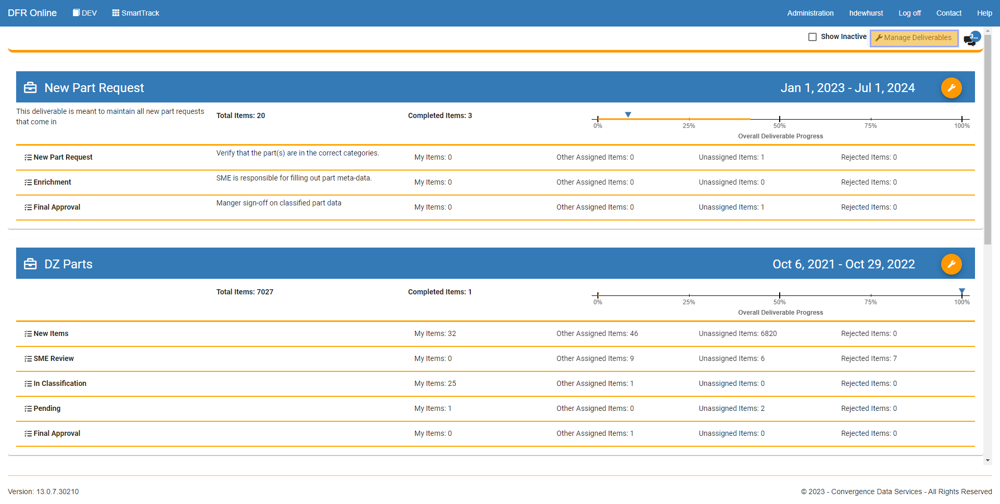
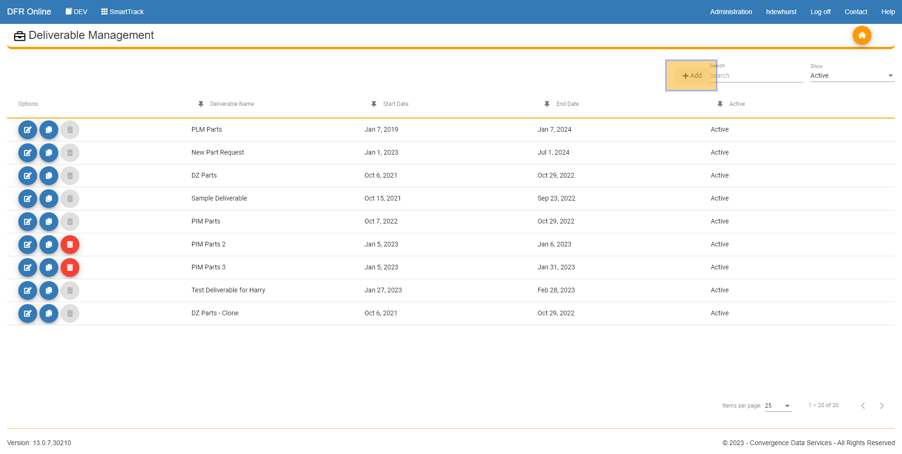
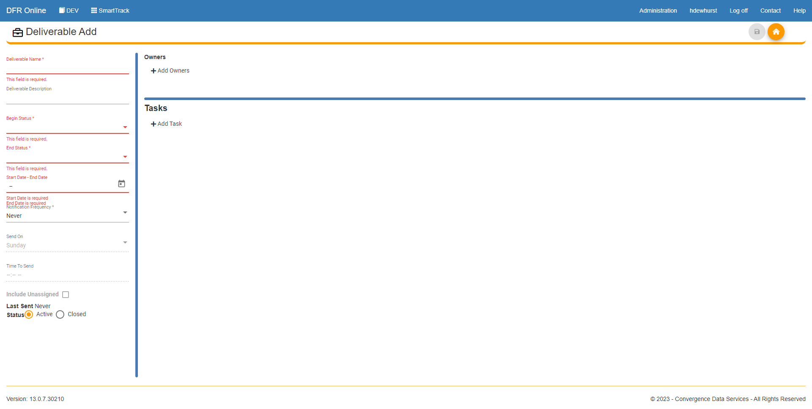
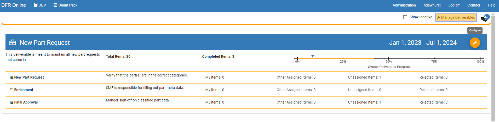
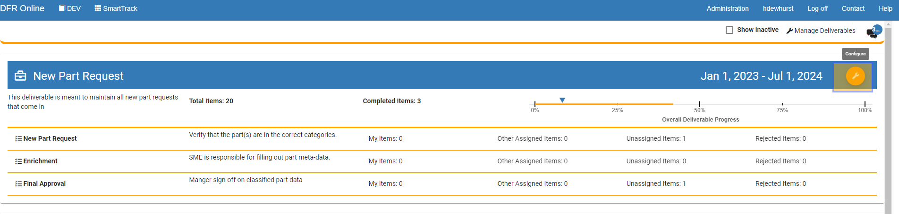

# Create and Manage a Deliverable

Create\_and\_Manage\_a\_Deliverable - Design For Retrieval (DFR) Help

&#x20;

## Create and Manage a Deliverable

&#x20;

Welcome to the documentation page for Convergence Data's SmartTrack module, where we will be discussing the creation and management of deliverables. As a comprehensive project management tool, SmartTrack is designed to streamline the process of delivering projects on time and within budget. The module offers an array of features that enable project managers and teams to collaborate effectively, track progress, and manage project deliverables. In this documentation, we will be focusing on the process of creating and managing deliverables using the SmartTrack module, and how it can help simplify the process and improve project outcomes. Whether you're a seasoned project manager or a newcomer to the field, this documentation will provide you with valuable insights and tips on how to make the most of SmartTrack's deliverable management capabilities. Let's dive in!

&#x20;

&#x20;

&#x20;

&#x20;

1. Log in to SmartTrack: To access the SmartTrack module, log in to your Convergence Data Services account. This will bring you to the dashboard where you can access all modules. Click on SmartTrack

2. To create a deliverable first click on the "Manage Deliverable" button in the top right of the screen.&#x20;

&#x20;

&#x20;

3. Now click on the "Add" button to add a new deliverable. If you already have deliverables made, you can click on the edit button next to any of them to edit a current deliverable.&#x20;

&#x20;

&#x20;

&#x20;

4. Now you can add all of the information that your new deliverable requires. On the right half of the page, you can add tasks and owners and groups to the tasks with their respective buttons.  Once you have finished entering in the information, click on the Save button in the top right of the screen to save your progress and create the deliverable.&#x20;

Note: All fields in red text are required to create a deliverable.&#x20;

&#x20;

&#x20;

5. Manage a deliverable: Once you have a deliverable created,  you can edit it two different ways. First, you can click on "Manage Deliverables" in the top right of your screen, then click the edit button next to the deliverable you would like to edit or delete.&#x20;

&#x20;

6. The second way to manage a deliverable is by clicking on the "Configure" button that is directly on each of the deliverables when you are in the home screen of SmartTrack. This button will allow you to edit all of the fields of the deliverable directly.&#x20;

&#x20;

&#x20;
