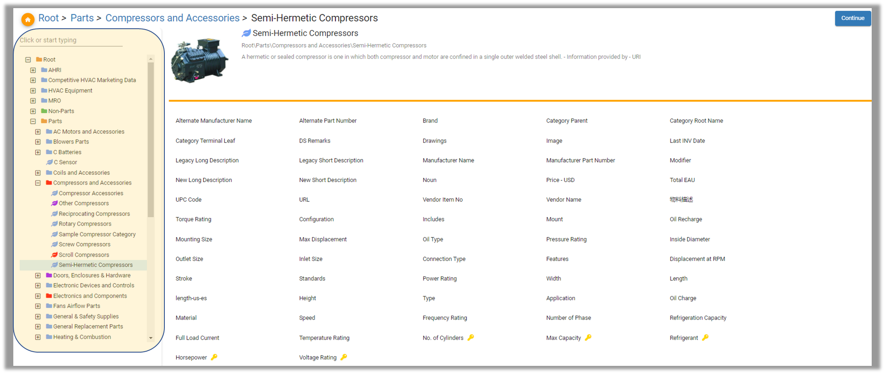
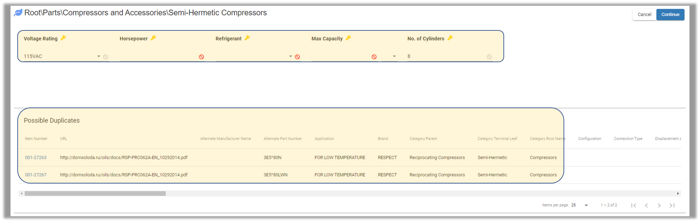
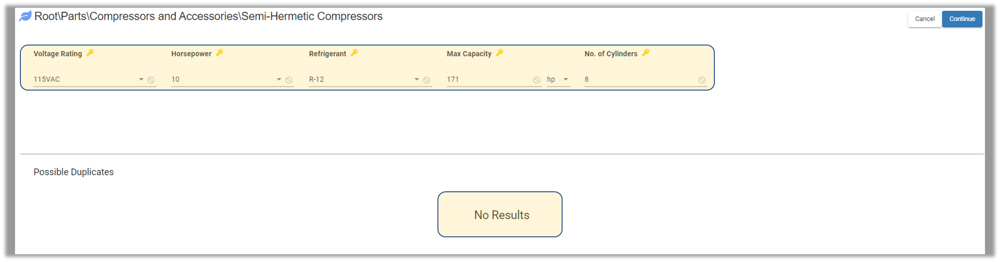
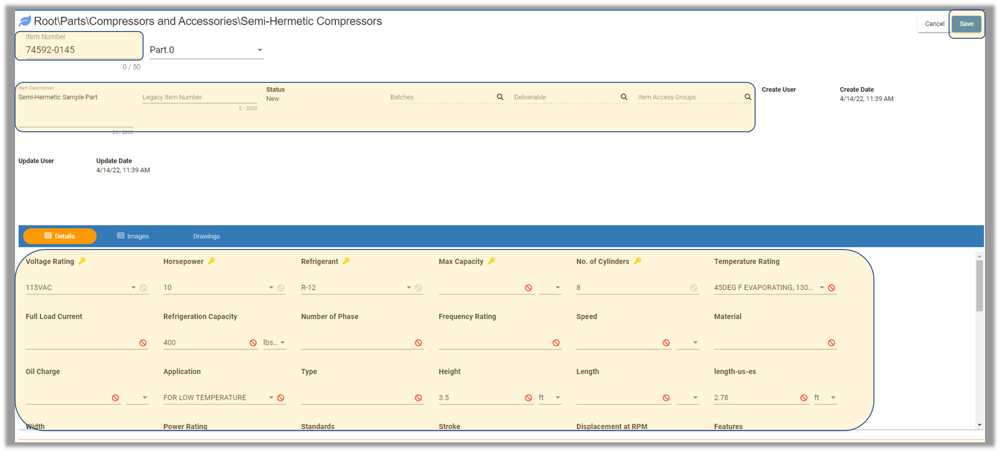
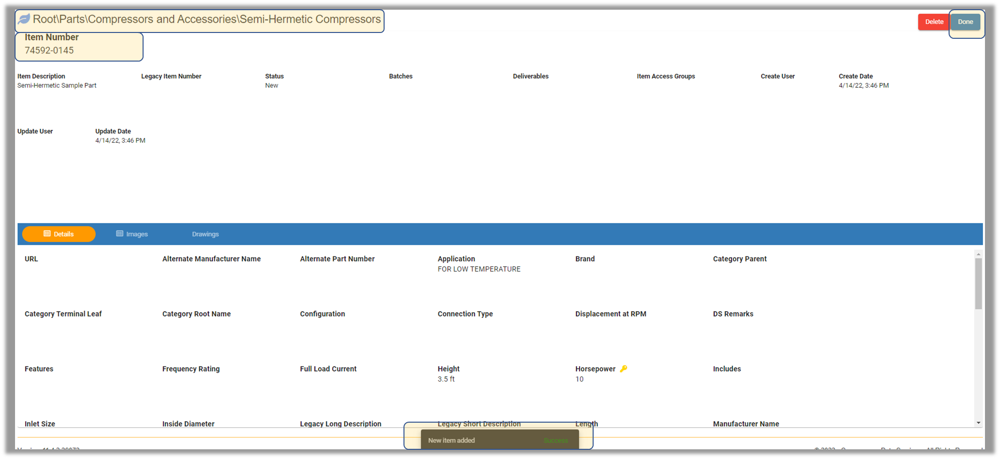
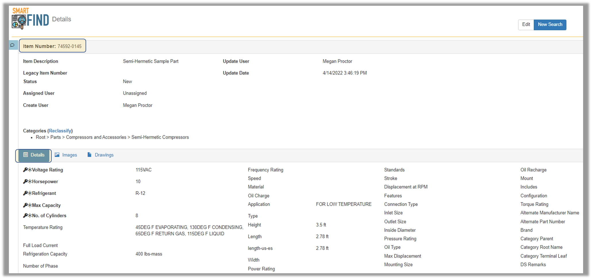

Create\_Parts - Design For Retrieval (DFR) Help

# Create Parts

SmartCreate is used to create new individual parts.

 

Select SmartCreate from the menu on the top left.

 

.png)

 

Select a category from the category data model located on the left side of the screen. Attributes for the selected category will be displayed on the right. 

Locate the desired category and select "Continue."

 

 

The third screen will display only Key Attributes for data entry. 

As each value is entered, the possible duplicates will appear at the bottom.

 

If the part already exists, it can be duplicated by utilizing a **qualifier** to essentially tell DFR that it is a new part. 
  

 

Once there are no possible matches, the item will be created as New. 

Select Continue.  

 

 

Begin by entering Item Number and Item Description. 

Minimally, the Item Number needs to be entered in order to save the new part. 
Then use the attribute table and fill in any applicable attributes. 

Users may utilize the ability to add to a batch, deliverable or item access group from this screen as well.

Select Save when complete.

 

  

 

The next screen will show the part has been created.  

 

 

To verify the part created exists in DFR, select SmartFind and search for the part.

 

