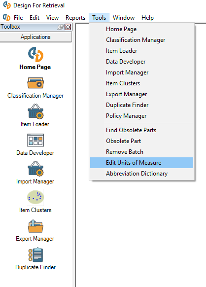
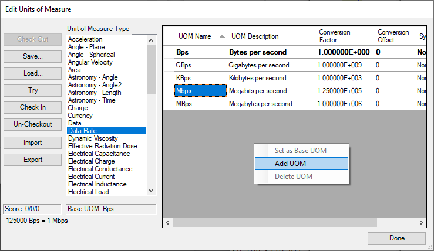
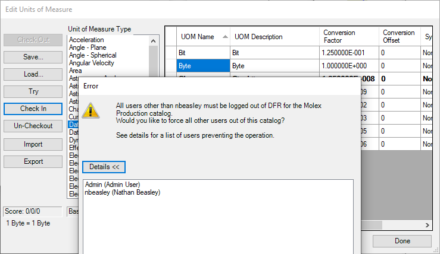

Creating\_a\_UoM - Design For Retrieval (DFR) Help

# Creating a UoM

 

In the Convergence PIM thick client, go to Tools > Edit Units of Measure

 

 

Once the Unit of Measure Editor opens, click the "Check Out" button in the top left so that you can edit the Unit of Measure table. Once that is done, you can find the Unit of Measure Type (in this picture, Data Rate) that you want to add the new unit under, and then in the empty space, right-click and select Add UoM.

 

 

Click on a box and start typing to enter/change data. The base unit for the unit type is stated towards the bottom left of the utility. In this case, if I wanted to add Megabytes, I would type the abbreviation I want, MB, into the Name field, set the description to Megabyte, and in the conversion factor, enter 1000000 (because 1000000 bytes = 1 megabyte). This will automatically convert to scientific notation when you tab off. As a last note, you save your changes by clicking "Check In". You cannot check in Unit of Measure changes with other users logged in, so if there are any others logged in, they will need to log out before you can commit the changes (optionally, you can force them out with the prompt that comes up shown below).

 

