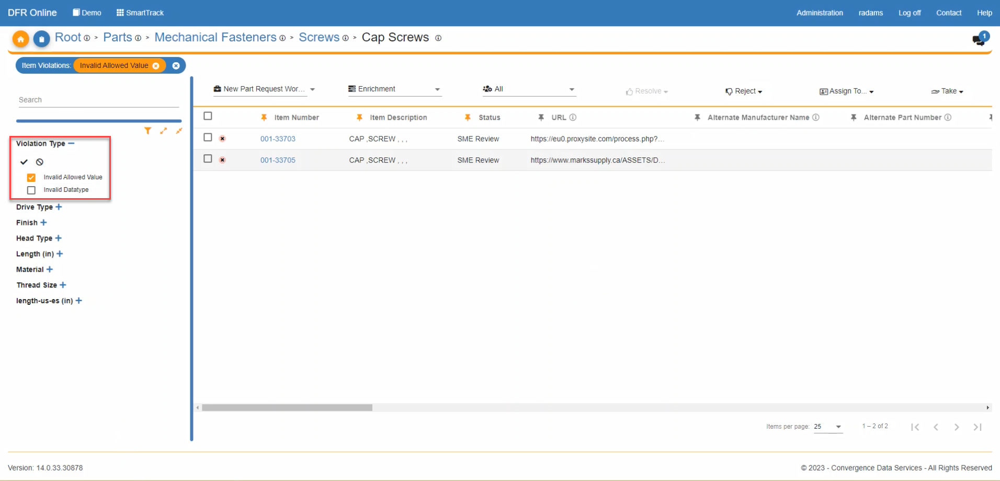
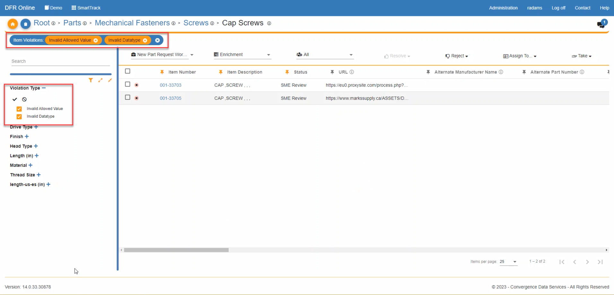
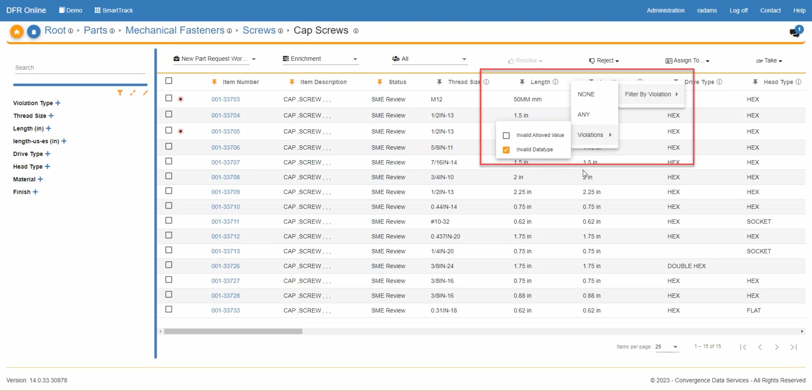

Data\_Validation\_Filtering - Design For Retrieval (DFR) Help

# Data Validation Filtering

Introducing a powerful enhancement: the ability to filter by data validation type directly on the item details page. This new feature streamlines your workflow, making it easier than ever to pinpoint and manage specific data categories with precision and efficiency.

 

 

1. When on the item grid view page on the left-hand side, you will see the filter called "Validation Type". Click the plus sign next to the filter to expand the list of filterable values. 

 

2. The user can now click on any of the Violation Types listed to filter. 

 

3. The "check mark" and the "error" symbol will check all of the filters and uncheck all of the filters. The filter tiles currently in use are also shown at the top of the screen.

 

 

4. The user can also filter by validation type on a specific attribute. Right click on the attribute name, then click on "Filter By Violation". 

 

 

The user can then click NONE, which will filter the items that do not have a violation for that attribute.

OR the user can click ANY, which will filter the items that have any type of violation for that attribute. 

OR the user can hover over "Violations", which will then provide a list on which the user can choose which specific violation they want to filter that attribute by. 

 

 

 

 

 

 

