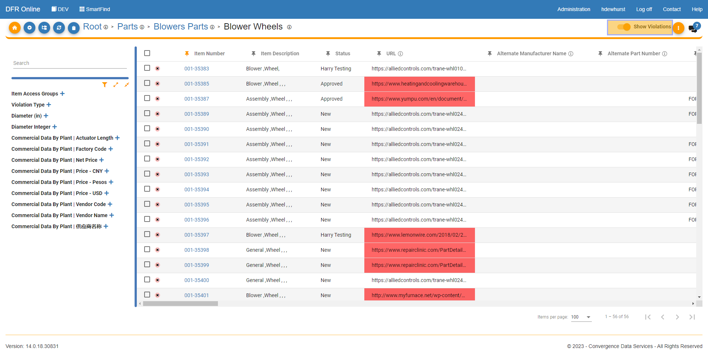
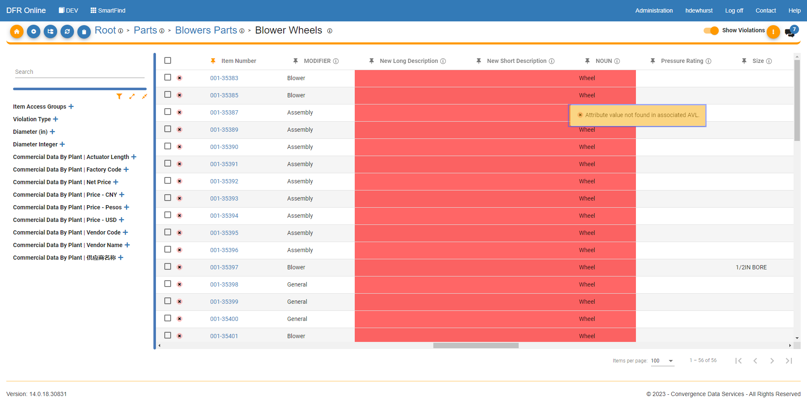
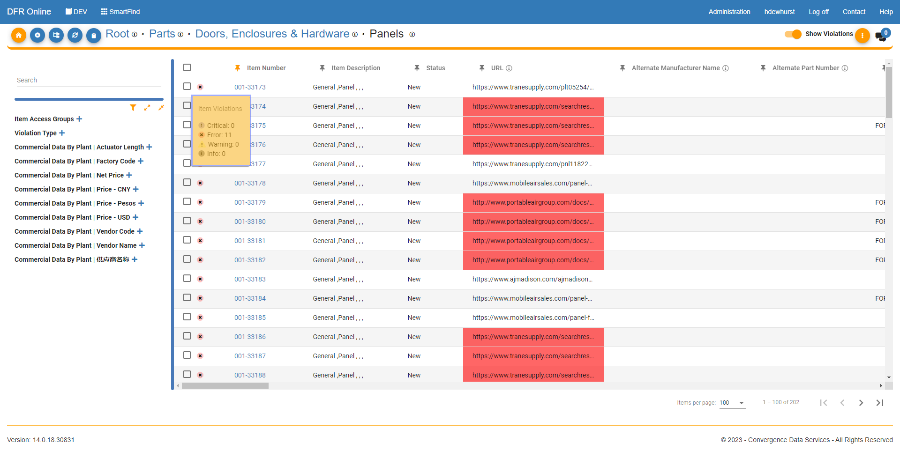
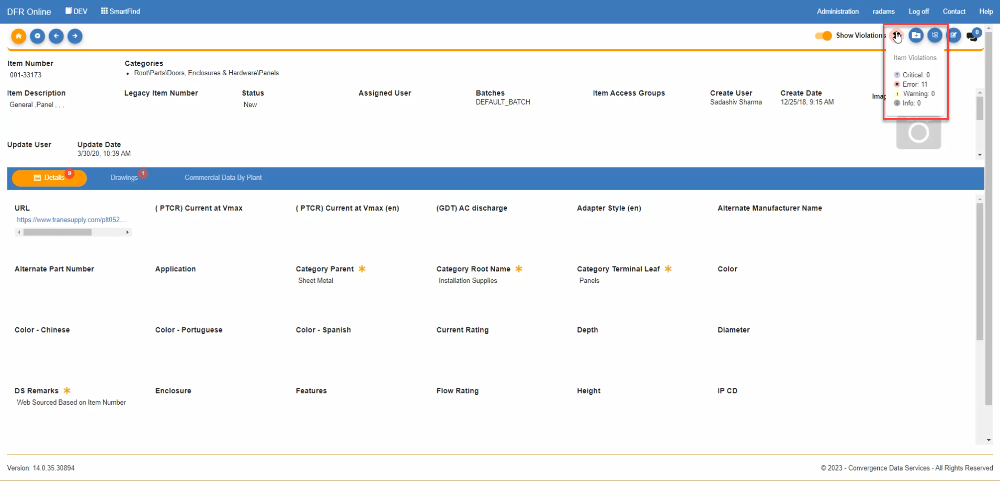
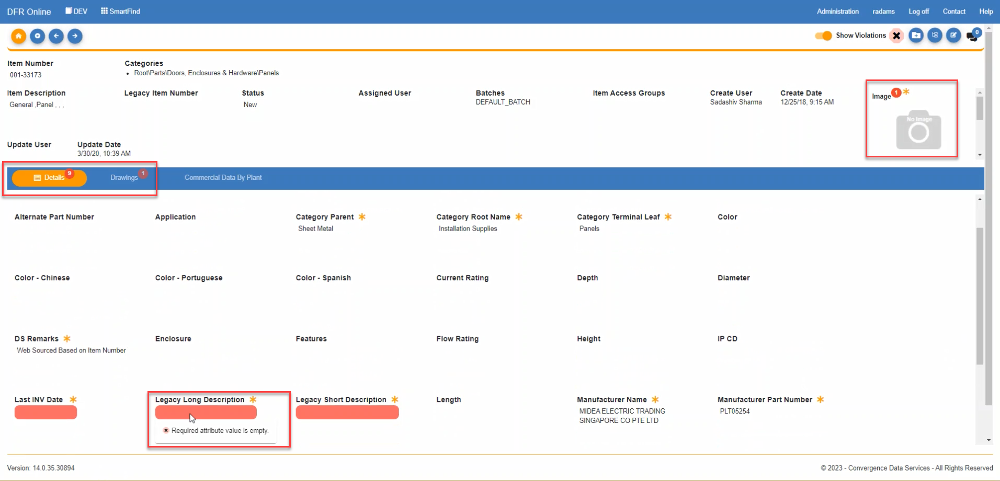
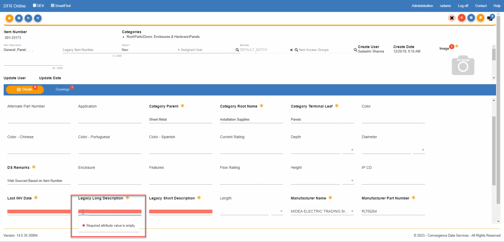

Data\_Validation\_Toggle - Design For Retrieval (DFR) Help

# Data Validation Toggle

 

1. When you are in the item grid view in a category, if you have the correct user permissions (System Administration), there will be a toggle button to show / hide validation errors.

 

 

2. When you hover your mouse over one of the red validation errors, it will tell you what the error is.

 

 

3. When you hover your cursor over the small red "x" at the far left of every item number, it will give a count of all the different validation errors that the item has. 

 

 

4. When you click on an item to view the item details, you will see a symbol in the top right corner of the page if there are violations present. The symbol displayed reflects the most severe violation present.

 

5. If you hover over the violation symbol, it will display a summary of the counts of violations by level of severity.

 

 

6. The attributes that have a violation are highlighted in red. The tabs with violations are indicated with a red circle that displays the count of violations on that tab.

 

7. When you hover your cursor over one of the attributes with validation errors, it will tell you what the error is.

 

 

8. If you click edit, the attributes that have a violation are still highlighted in red.

 

 

9. If you make an update to resolve a violation and click save, the attribute should no longer be highlighted in red.

 

 

 

