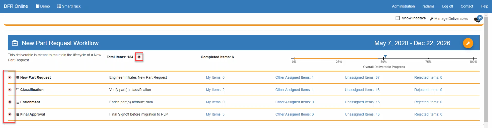
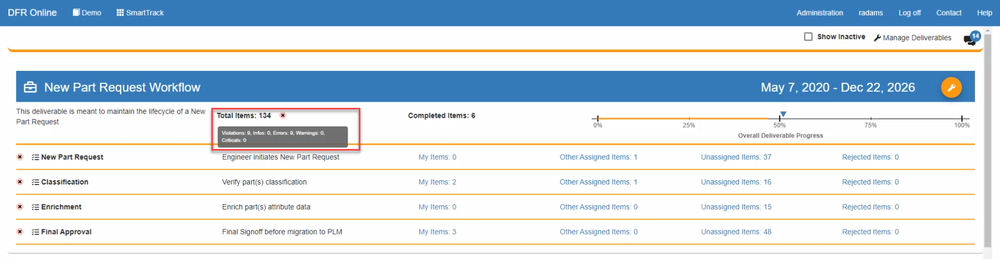
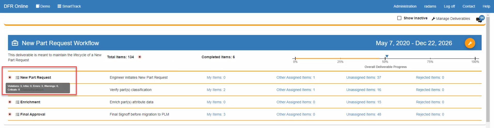
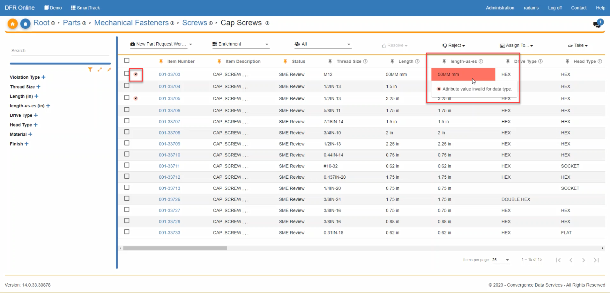
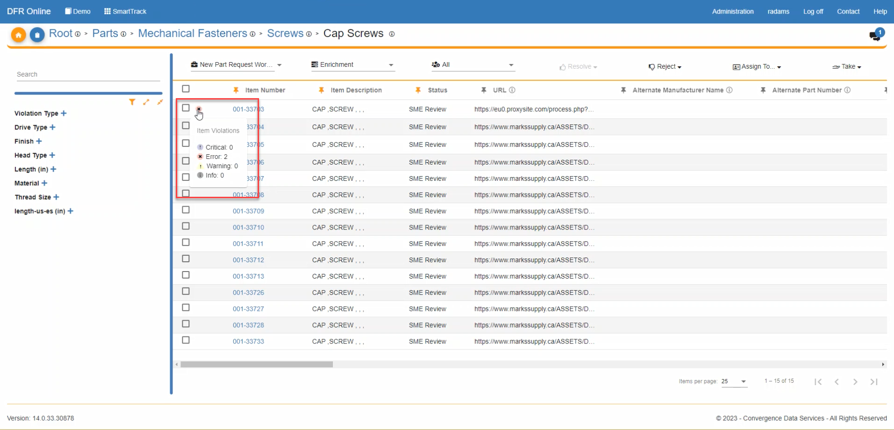
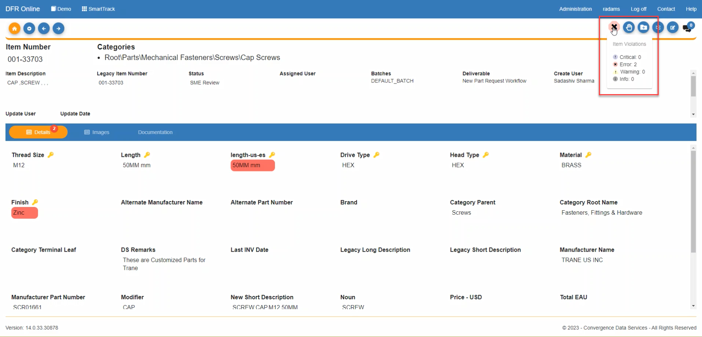
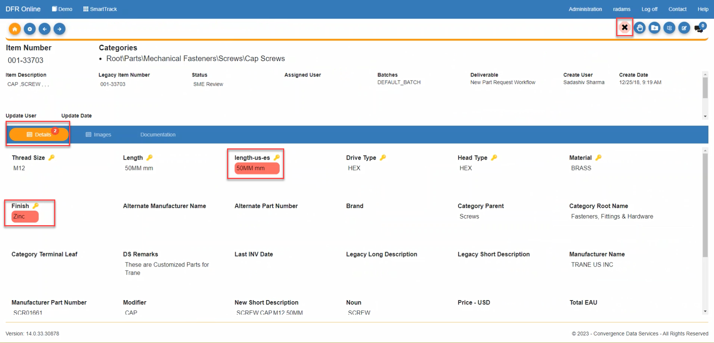
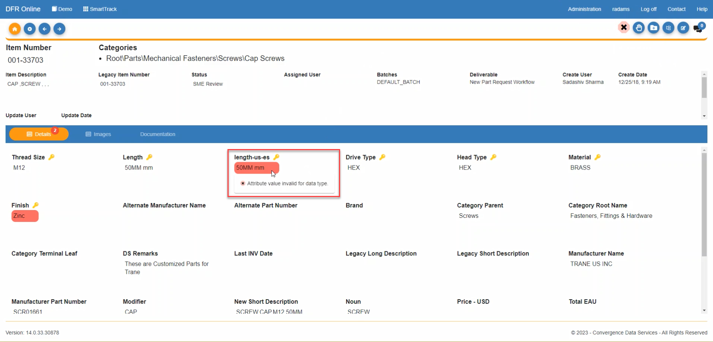
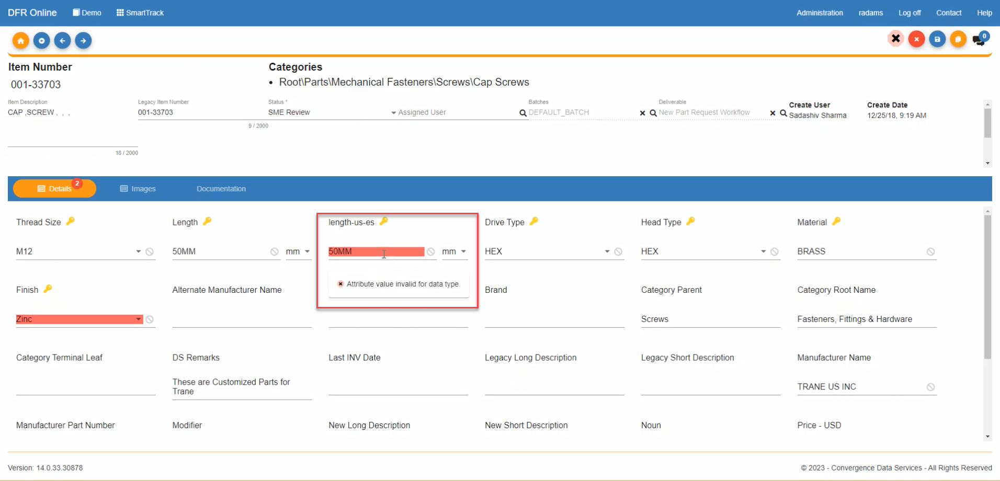

Data\_Validations\_in\_SmartTrack - Design For Retrieval (DFR) Help

# Data Validations in SmartTrack

1. When you are in a deliverable or are viewing the deliverable summary dashboard and you have the correct user permissions (System Administration), you will be able to see validation errors.

 

2. On the deliverable, there is a symbol displayed when violations are present. The symbol displayed reflects the highest level of severity. This violation symbol can appear in the total number of items in the deliverable, as well as next to each task name.

 

 

3. When you hover your cursor over the violation symbol next to the Total Items, it will display the count of errors based on the level of severity for the entire deliverable.

 

 

4. When you hover your cursor over one of the violation symbols next to a deliverable task, it will display the count of errors based on the level of severity for that particular deliverable task.

 

 

5. Violations will also be present on the item grid view page for the deliverables. When you hover your mouse over one of the red validation errors, it will tell you what the error is.

 

 

6. When you hover your cursor over the small red "x" at the far left of every item number, it will give a count of all the different validation errors that the item has. 

 

 

7. When you click on an item to view the item details, you will see a symbol in the top right corner of the page if there are violations present. The symbol displayed depends on the highest level of violation present.

 

8. If you hover over the violation symbol, it will display a summary of the counts of violations by level of severity.

 

 

9. The attributes that have a violation are highlighted in red. The tabs with violations are indicated with a red circle that displays the count of violations on that tab.

 

 

10. When you hover your cursor over one of the attributes with red validation errors, it will tell you what the error is.

 

 

11. If you click edit, the attributes that have a violation are still highlighted in red.

 

 

12. If you make an update that resolves a violation and click save, the attribute should no longer be highlighted in red.

 

 

 

