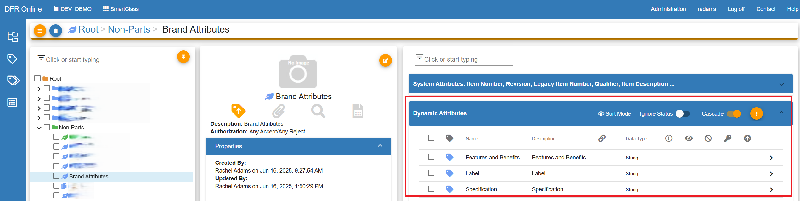
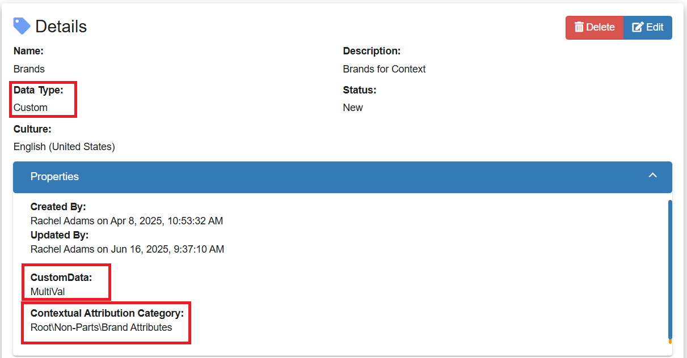
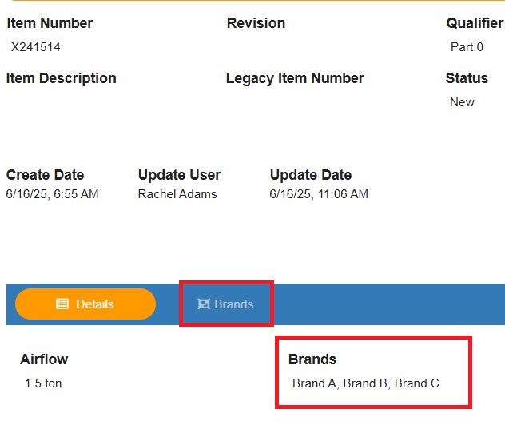
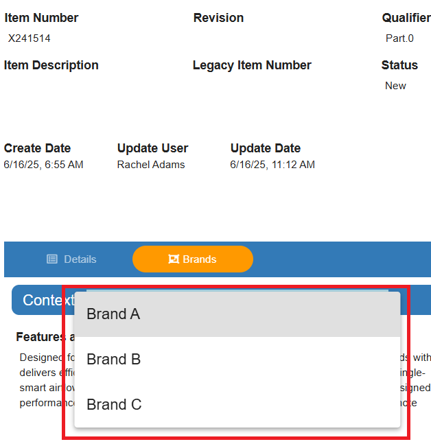
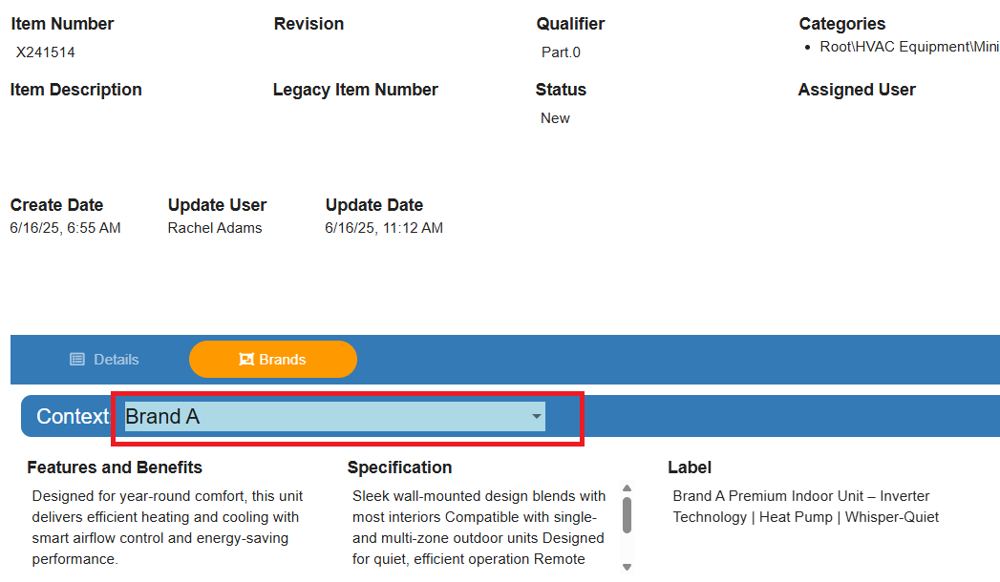
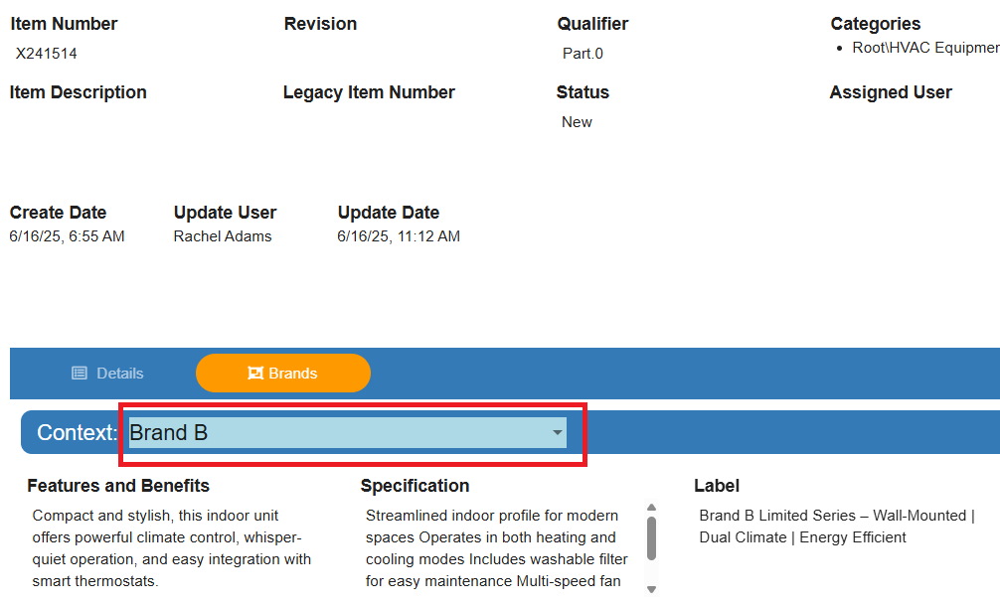
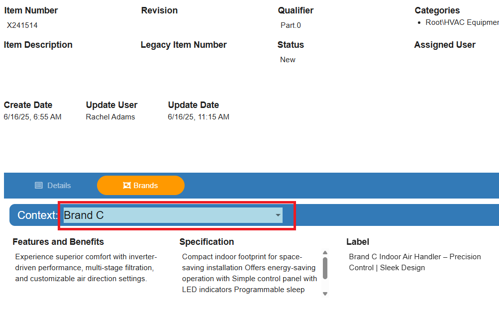

Document - Design For Retrieval (DFR) Help

# How to Set Up Contextual Attributes

- **Contextual Attributes** should be used when the information for a single item can vary depending on a specific context. For example, you may need to enter different attribute values for the same item based on region, syndication channel, brand, or customer segment.
- Concepts:
	- **Contextual Attributes** are the attributes where the contextual options are selected.
	- A **Contextual Attribution Category** is where the attributes that vary by context are managed.
- Steps:
	- SmartClass
		- Set up the Contextual Attribution Category
			- Create a category and assign the attributes that could differ among selected contexts
			- 
		- Set up the Contextual Attribute
			- Data Type: Custom
			- CustomData: MultiVal
			- Contextual Attribution Category: *select the category created in the previous step*
		- Assign to the appropriate category or categories
			- It is not required to set up an AVL for contextual attributes, but it is strongly recommended.
	- SmartFind
		- Populate the contextual attribute with the appropriate values
		- This will create a new tab. The tab will have the same name as the contextual attribute
		- Click on the tab to view the attributes that differ depending on the selection made
			- Click on the drop down to select the different contexts to view or edit
			
			
			
			
			
			

 

