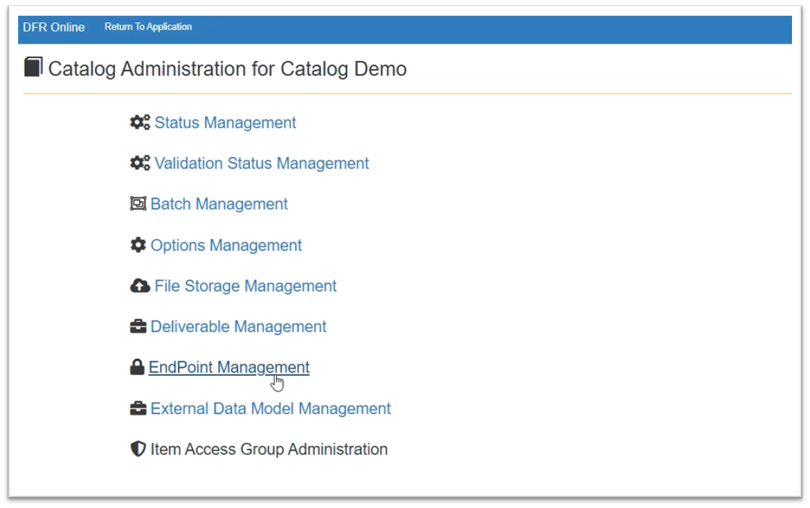

EndPoint\_Management - Design For Retrieval (DFR) Help

# EndPoint Management

**In the EndPoint Management editor, you have the ability to add, edit, disable, or delete configured endpoints.**

Supported endpoint types are:

- SFTP
- API
- Azure
- Alibaba

 

Navigate to **Catalog Administration** to find **EndPoint Management**.

(Click on Administration, then Catalog Administration.)

 

The EndPoint Management page provides an overview of all active endpoints, including the type and active status. 

.png)

The options buttons on the left-hand side allow you to quickly Edit, Clone, or Delete an endpoint.

.png)

## Creating a New EndPoint

1. Navigate to the EndPoint Management page.
2. At the top left, click on the icon that corresponds what type of endpoint you want to create.  

.png)
3. Name your endpoint and fill out the parameter fields.  

.png)
4. Click save at the top right.
5. Your endpoint is now ready to use.

 

**Related Pages:**

- **[SmartFeeds Overview](smartfeeds)**
- **[Feed Manager](default-template-4)**- How to view and manage import feeds
	- **[Deliverable Import Feeds](deliverable-import-feeds)**- How to set up a deliverable import feed
	- **[Import Feeds](default-template-1730124762)** - How to set up an import feed
- **[External Data Model Management](external-datamodel-management)** - How to view and manage external data models

