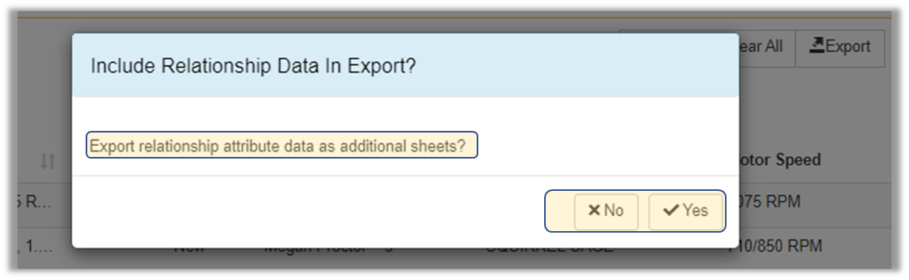

Export\_Parts - Design For Retrieval (DFR) Help

# Export Parts

SmartFind allows you to export categories out individual parts into an Excel file at **any category level.**

 

 

<iframe src="https://www.youtube.com/embed/qqAqRw4qcSA/?wmode=transparent" width="560" height="315" frameborder="0" allowfullscreen></iframe>

 

 

Go to SmartFind

 

.png)

  

 

Select any category at any level.

In this case, the selected category is at the lowest leaf node.  

 

.png)

 

Once all parts are shown, click on Export; this will generate and download an Excel file to your PC.

This excel file will contain all parts under the selected category.  

 

.png)

 

Filters can also be applied and only those shown will be exported.  

 

.png)

 

Parts can be selected individually by check-marking the empty boxes next to the parts. Only those selected parts will be exported to an excel file.

In this example, only 5 parts will be shown in the excel file.  

 

.png)

 

If the items contain relationship data, a window will pop up informing the user and asking to export to separate sheets. 

 

 

Part numbers can be typed in the Search box. 

In this example, only parts that begin with "**001-000**" will be downloaded to the excel file.  

 

.png)

 

The exported file will include all information, including: item number, item description, category path, technical attribute data as well as relationship data - where applicable. 

 

.png)

