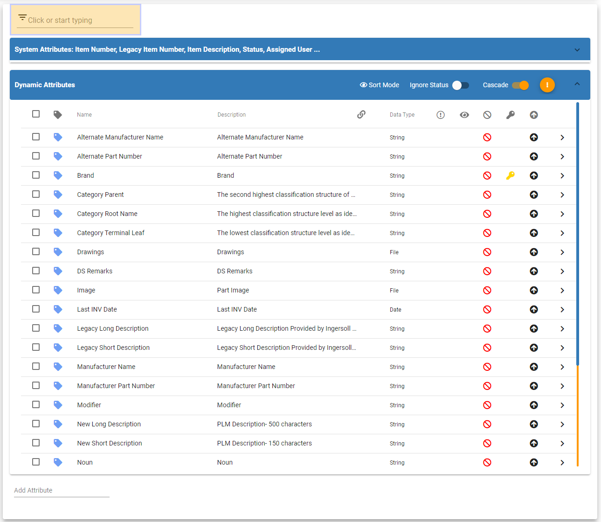
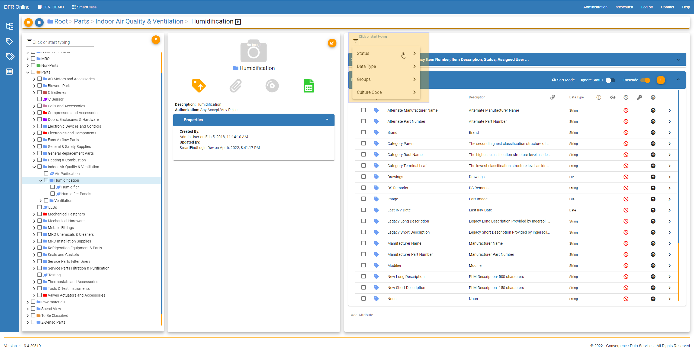
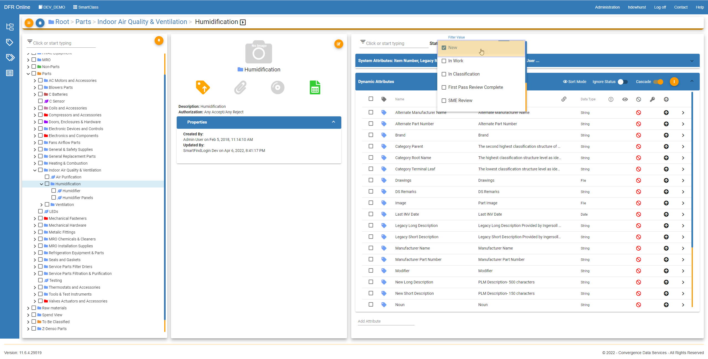

Filter\_Attributes - Design For Retrieval (DFR) Help

# Filter Attributes

 

Navigate to SmartClass and click the orange button called "Category Tree" 

 

 

Now you can click the orange "thumbtack" button to pin the tree on the page. 

 

Then drill down to the category that you would like filter attributes by. 

 

 

This is the filter bar to filter by attributes. You can type text or numbers into the filter bar to filter by attribute name. You can also filter by data type, status, groups, or culture codes. 

 

 

Typing text in the filter bar will filter the attributes below.

 

 

 

By just clicking in the search bar you can then click to sort by status, data type, etc. 

 

 

For example, you can click on status and then pick what status you want to filter by. This will then filter the attributes by the status you choose. 

 

