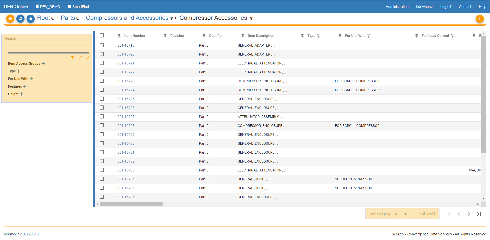
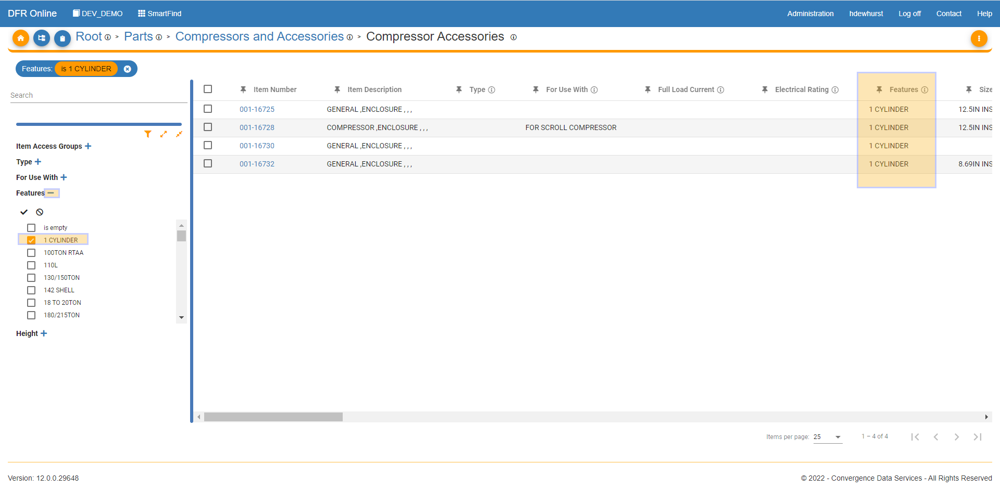
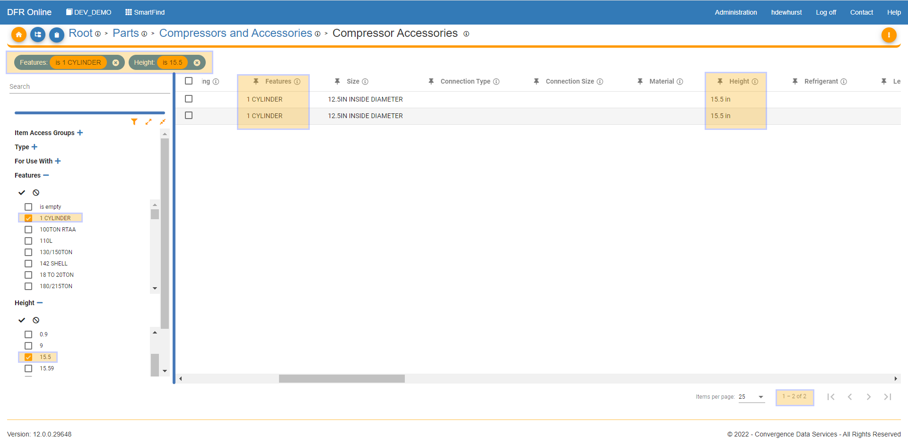
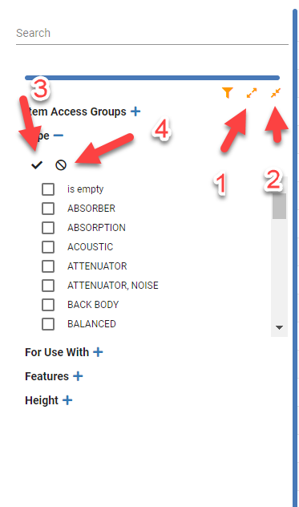
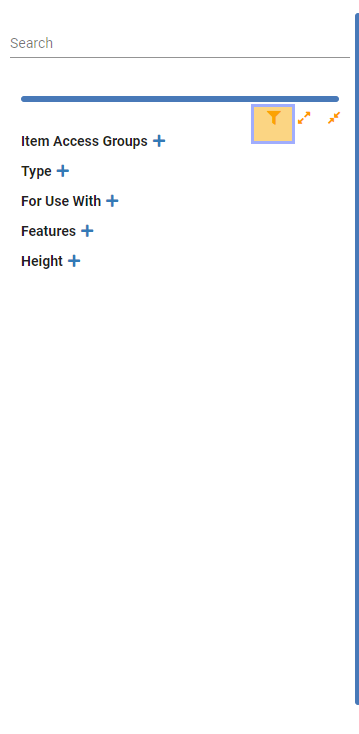

# Filter on Parts

Filter\_on\_Parts - Design For Retrieval (DFR) Help

&#x20;

## Filter on Parts

Convergence PIM allows you to filter on any number of attributes by setting them as Key Attributes.

Attribute filters allow you to select which values of a given attribute should be displayed.

Each attribute filter pertains to a single attribute (for example, Ball Type) but contains a number of discrete attribute values to select from (for example, Football, Soccer Ball, Volleyball, Baseball.).

&#x20;

Filters are set up based on Key Attributes.

For more information on Key Attributes, please view the help page:  [Set Attributes as Key, Required, DNA, and Read Only](filter_on_parts.md).

&#x20;

In SmartFind, go to a category at any level where you have key attributes.

Filters are located on the left side of the screen.&#x20;

&#x20;

As shown on the screenshot below, there are 5 attributes filters available.

&#x20;

&#x20;

Values under those attribute filters can be shown by clicking on the "+" sign next to them. This will expand to show the Allowed Value List.&#x20;

Please see: [Creating an Allowed Value List (AVL)](filter_on_parts.md) for more information.

&#x20;

As shown on the screenshot below, values under 'Connection Type' are displayed. Thus when clicking on an attribute value, only parts with those attributes values will be displayed.

&#x20;

&#x20;

Alternatively, you can click on more than one value under one attribute filter or multiple attributes filters.

&#x20;

&#x20;

The following options:

*
  1. Expand All = Show all attribute values under all filters
*
  2. Collapse All = Hide all attribute values under all filters
*
  3. Select All = Select all of the attribute values under a specific attribute filter
*
  4. Clear All = Remove all checkmarks for all attribute values selected

&#x20;

The following options under Advanced Filters:

* 
* Item Status Filter = Allows you to filter on one or multiple Part Status
* Assigned User Filter = Allows you to filter on one or multiple Users
* Please see the Advanced Filtering Page to learn more about advanced filtering in SmartFind.

###

&#x20;

&#x20;

&#x20;
