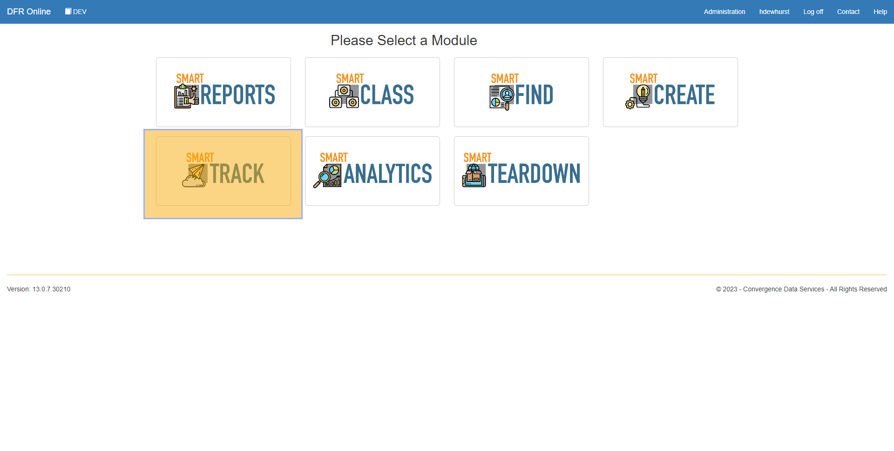
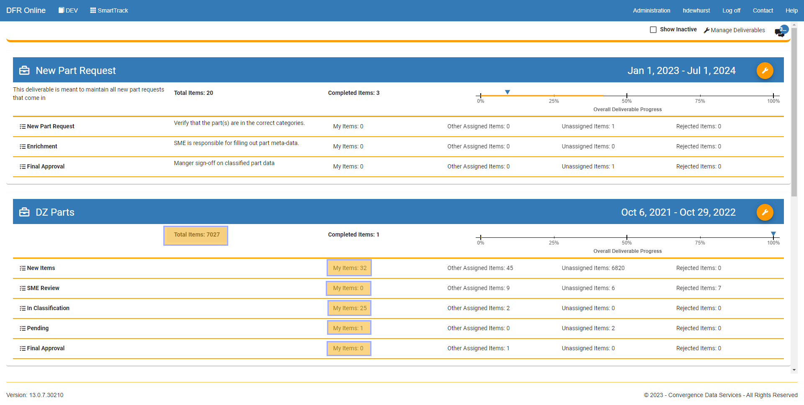
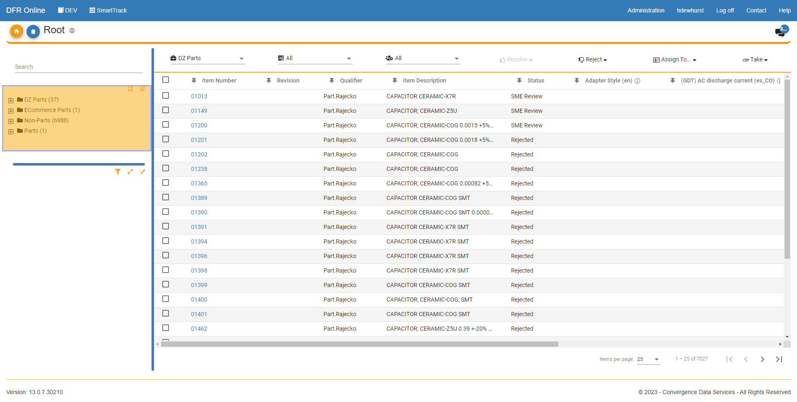
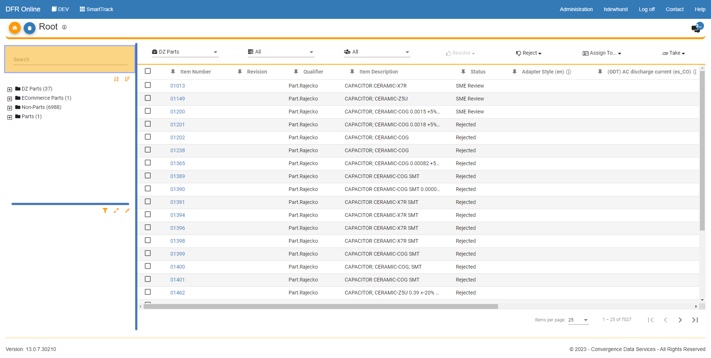
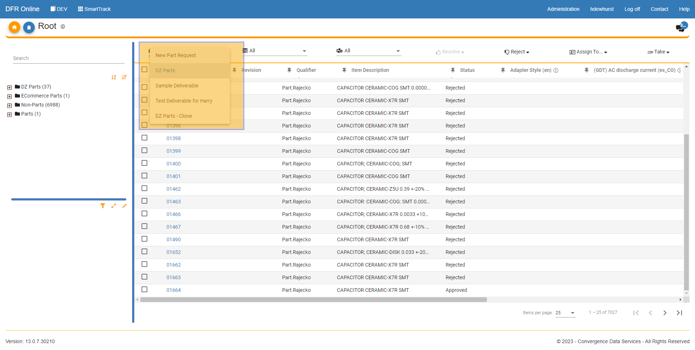
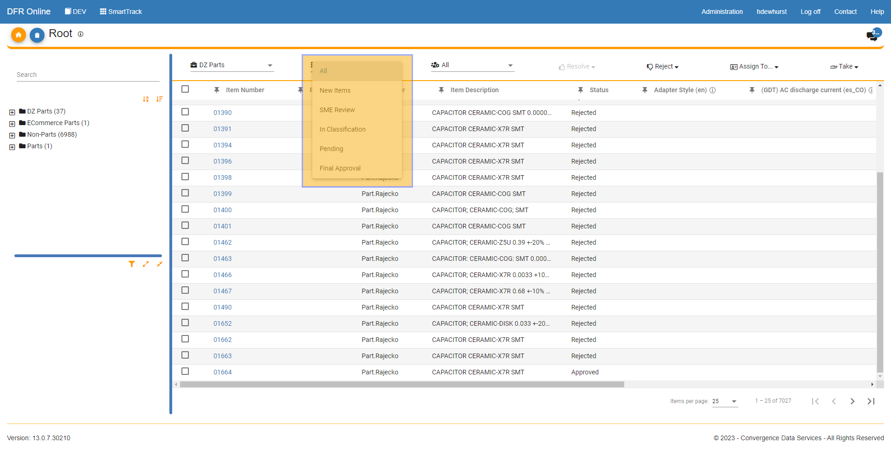
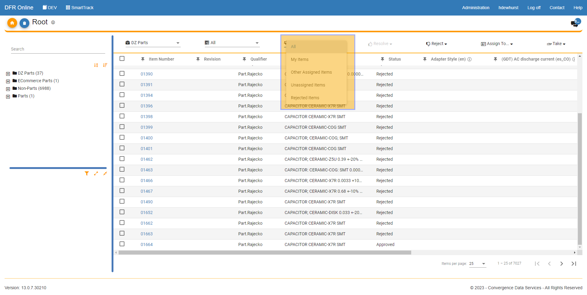
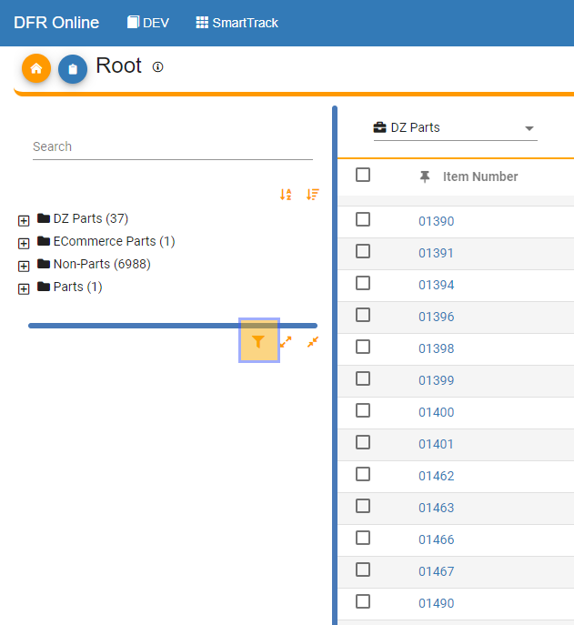
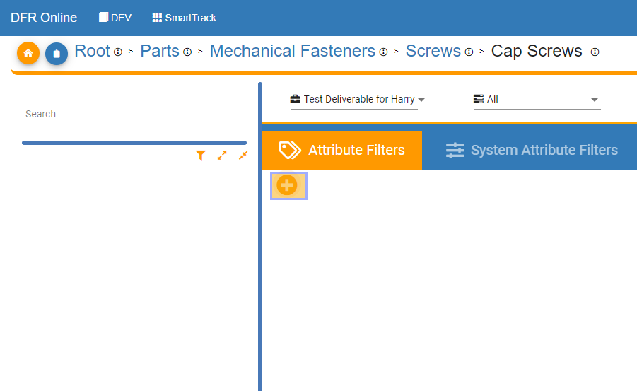
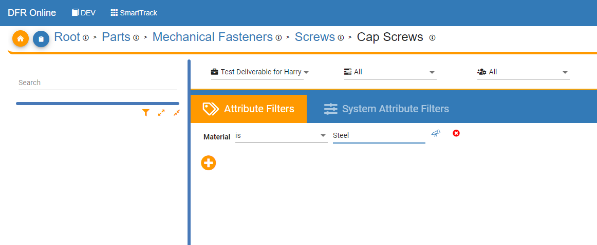

Filter\_Sort\_and\_Search\_Items - Design For Retrieval (DFR) Help

# Filter, Sort, and Search Items

 

Welcome to the documentation page for Convergence Data Services' SmartTrack module! In today's fast-paced business environment, managing and tracking data can be a daunting task, which is why SmartTrack has been designed to help organizations effectively track and manage their data. The SmartTrack module provides a wide range of functionalities, including filtering, sorting, and searching items, to help users quickly and easily find the data they need. In this documentation page, we will walk you through the steps to use SmartTrack's filtering, sorting, and searching features to help you better manage and track your data.

 

1. Enter the SmartTrack Module by clicking on the SmartTrack button after you log into your CDS PIM account. 

 

 

2. From the home page of SmartTrack, click on "Total Items", which will show you all of the items assigned to that deliverable. Or click any of the buttons that say "My Items" if you have items assigned to you in that task or "Other Assigned Items" if you want to see the items in that task that are not assigned to you.  

 

 

3.  When you click on any of the buttons described in step 2 you will be brought to this screen. The first highlighted section in the upper left hand corner is the category tree. You can expand and collapse the tree to drill into or out of specific categories of parts that are in your task or deliverable. Click the plus sign to expand a category and the minus sign to collapse a category. 

 

 

4. Next, there is a "Quick Search Bar" where you can search by keyword, category, or item number. The results will populate in a list on the right side of the screen. 

 

 

5. On the top navigation bar, you can click on the deliverable name you are in and you can then move to see the items that are in other deliverables by clicking the deliverable name. 

 

 

 

6. In the second drop down menu on the top, you can filter by status. Click the drop down menu and all of the current statuses for the deliverable will be shown. Click one to filter on a specific category. 

 

 

 

7. In the third drop down menu you can filter by items that are assigned to yourself, other people, items that are unassigned, and items that are rejected. Click the drop down menu and click any of these buttons to filter. 

 

 

8. The next two buttons on the top have the function of Resolving or Rejecting items. There is a link to that page [here](untitled-1675769140). 

 

9. The "Assign To" button can be clicked to assign an item or multiple items to a user. The "Take" button can be clicked to assign an item or items to yourself. 

 

10. You can click on the funnel icon to enter the Advanced Filtering section within SmartTrack. 

 

11. Now, click on the plus sign to add an Attribute Filter. Remember, you must be in a leaf category to use attribute filters. 

 

 

12. Click an attribute you would like to filter by, then click an operation. In this example I clicked the Material attribute and the "Is" operation. Then in the next field I entered "Steel". This will filter the items that have a material with the value "Steel". For numeric attributes, you can choose other operations such as greater than or less than to give ranges of values. Once you have filled in the required fields, click "Apply" in the bottom right of your screen and the filter will be applied.   

  

 

 

 

 

 

 

 

 

 

 

