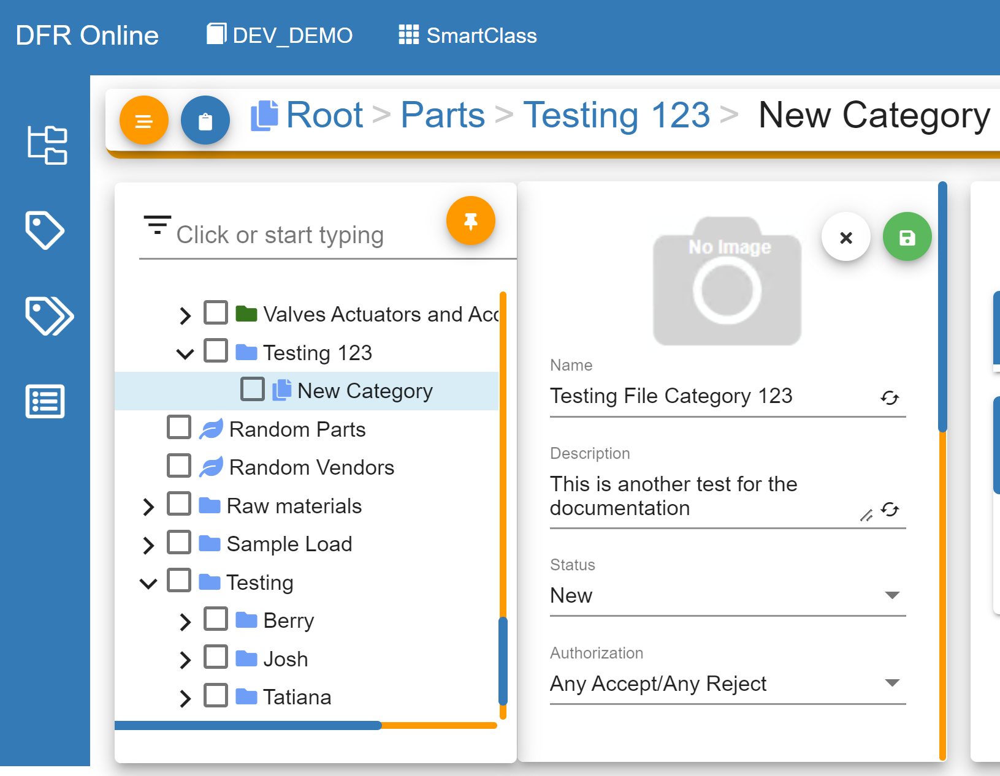

How\_to\_Add\_Documents\_or\_Files\_to\_Items - Design For Retrieval (DFR) Help

# How to Add Documents or Files

This feature allows users to attach documents, files, images, and more to an item; any type of file is allowed to be stored.

They can be downloaded once files have been loaded in Convergence PIM.

Soon you will be able to add files as attachments to categories.

 

## Adding Documents or Files to Items

**Create a File Category**

File Category is a category that is used to store the meta-information about images, documents, or files.

Preferably, File Categories are created under the defaulted Non-Parts category.

This feature allows users to attach documents, images, and more to items; thus, these files will be stored as items in a File Category.

 

In classification, locate the category where your File Category will be created.

In this example, the File Category will be created under Non-Parts.

Hover over Non-Parts and three dots will appear next to the category. 

Click on the dots.

_1.png)

 

Click on Create a select File Category.

_1.png)

 

Please give a name and description to your new File Category and click the green save button.

The category name can be updated in the category properties.

 

 

Go into Convergence PIM and select SmartClass.

_1.png)

 

## 

Select the Attributes icon to create an attribute.

## .png)

 

Update the Description, and update the Data Type to "File". 

## .png)

 

Also, update the following attribute properties to have the following values:

- File Type: Select "Text"
- Classification Category: Select the File Category that was created earlier
- File Storage: Select "Azure Storage"
- File Storage Configuration: Select "Default"; or Select "Document" if available
- File Qualifier: Type "Document.0"

.png)

 

 

Now go to the Classification icon and select the category where this attribute will be added. This can be added at a leaf level or even at a parent level. 

.png)

 

 

## Adding One Document or File at a Time

Now files can be added to an item in Convergence PIM.

Go to SmartFind, and select the category where the attribute "Documents" was created.

.png)

 

Now that all items are displayed, click on the item.

.png)

 

Once one item is selected, click on Edit.

.png)

 

Once in the Edit page, select the "Documents" tab; this is the attribute that was created in Step 2.

Then click on "Add File". 

.png)

 

Now select the desired file. Any type of file will be stored in Convergence PIM.

.png)

 

Once the file is selected, it will be displayed under the documents tab.

Click on Save.

.png)

 

Also, multiple files can be added to an item by repeating the same process; you can see that the files stored have different data types.

You can also delete files from here by clicking on "Delete" next to the chosen file(s).

Click on Save to keep all changes.

.png)

 

Now, under the Documents tab, you can click on any of the links to download the attached file(s).

.png)

 

## Adding Multiple Documents or Files at a Time

First, create an excel spreadsheet where items will be mapped to the desired documents. Use this model as a template.

- Column A - Item Number: Type the item numbers
- Column B - File Path: Type the name(with the file type) of the files to be mapped to the item numbers
- Workbook Name - Documents: This is name after the attribute created earlier, here the documents will be stored.

.png)

 

Go to the Import Manager in the Thick Client.

Click on Item Data.

 

.png)

 

Click on Browse to select the Excel mapping file; the one created above.

Then click on Next.

.png)

 

Select Excel as the Import Format.

.png)

 

 

Under Item Options, click on the "..." next to Import files from directory to select the folder where the files are stored.

Click on Ok.

.png)

 

Click on More Fields... to pull the attribute that was created earlier.

.png)

 

Type in the attribute in the Name Search box. Once the attribute is found, click on Add Selection(s) and the attribute will be displayed on the bottom.

Now click on Add.

.png)

 

In Item Mappings, make sure to do the following changes:

- Operation: Select "Update".
- Item Number: Select "Item Number" unless this attribute was named differently in the Excel file.
- Qualifier: Leave it as "Part.0".
- Under Documents:
	- Qualifier: Leave it as "Document.o".
	- File Path: Select "File Path" unless this attribute was named differently in the Excel file.
	- Operation: Select "Add"

Click on Next

.png)

.png)

 

Click on Next

.png)

 

Click on Validate

.png)

 

Click on Next

.png)

 

Last, click on Import

.png)

