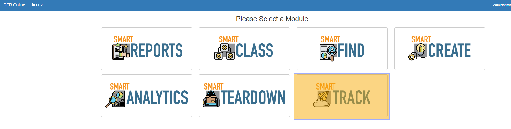

How\_to\_Navigate\_SmartTrack - Design For Retrieval (DFR) Help

# How to Navigate SmartTrack

SmartTrack is a powerful tool for tracking and managing data within your organization. With SmartTrack, you can easily locate and retrieve data from any source, ensuring that you always have access to the information you need.

 

 

To navigate the SmartTrack module, follow these steps:

 

1. **Access the SmartTrack module:** To access the SmartTrack module, click on the "SmartTrack" tab in the main menu of the Design for Retrieval software.
2. **Search for data:** To search for data within the SmartTrack module, use the search bar at the top of the page. You can search for data by keywords, tags, or other criteria.
3. **Use search filters:** You can use the search filters on the left side of the page to narrow down your search results. These filters include options such as data type, location, and date range.
4. **View search results:** Your search results will be displayed in a list on the right side of the page. You can click on any result to view the data in more detail.
5. **Use the data lineage feature:** The SmartTrack module includes a data lineage feature that allows you to track the origin and movement of data within your organization. To access this feature, click on the "Data Lineage" tab in the main menu.
6. **Manage user access:** You can use the SmartTrack module to set permissions and controls to ensure that only authorized users have access to specific data. To manage user access, click on the "User Access" tab in the main menu.
7. **View audit logs:** The SmartTrack module includes detailed auditing and reporting capabilities, allowing you to track data usage and access across your organization. To view audit logs, click on the "Audit Logs" tab in the main menu.

 

 

Overall, the SmartTrack module is a valuable tool for tracking, managing, and organizing data within your organization. By using the features and functions described above, you can easily locate and retrieve data, track its movement and usage, and manage user access to ensure data security.

