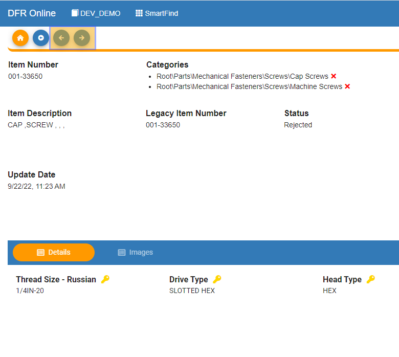
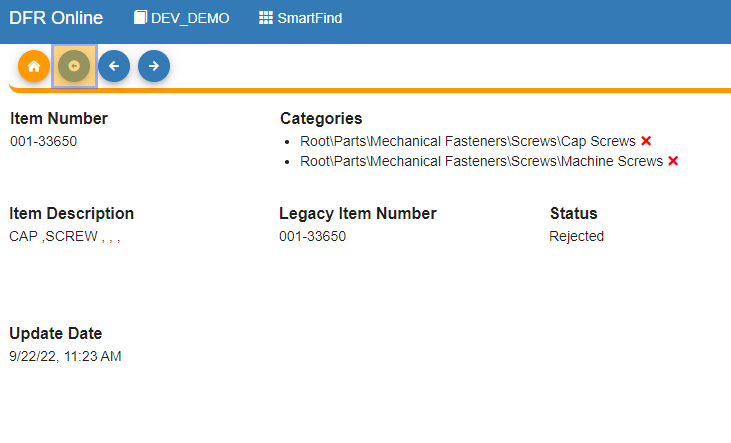
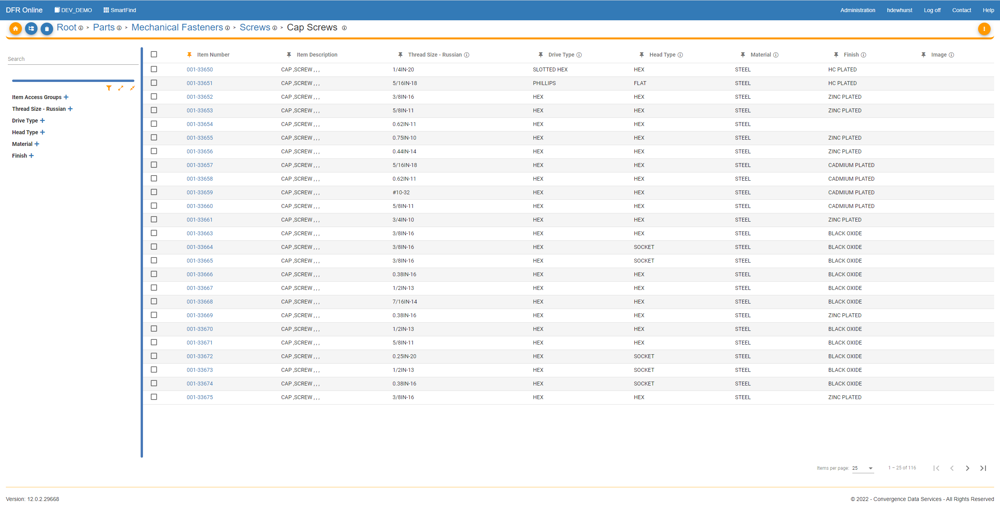
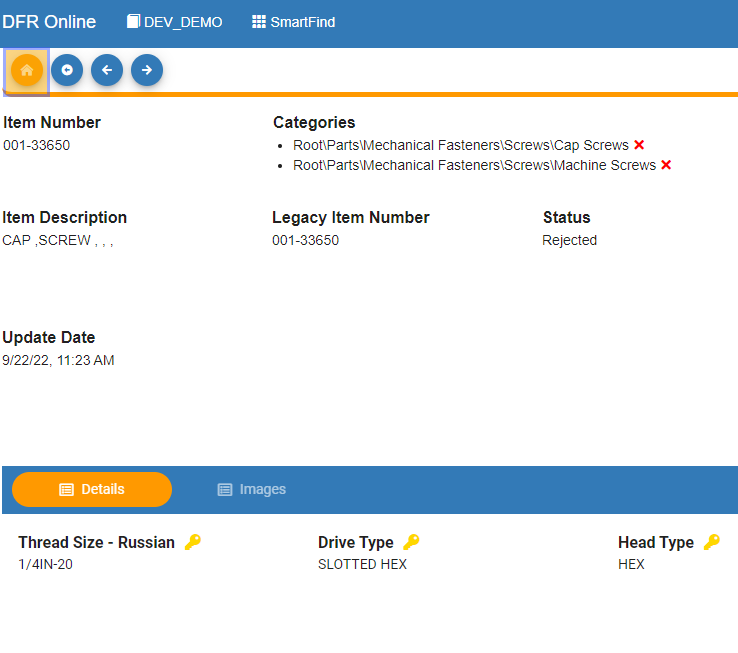
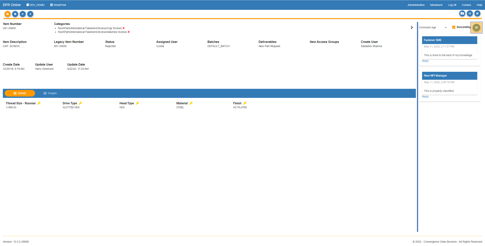

# Item Details

Item\_Details\_ - Design For Retrieval (DFR) Help

## Item Details

&#x20;

To page through the items that you have in a certain category, you can use the "Next Item" and "Previous Item" buttons.&#x20;

&#x20;

When you click the "Next Item" button you will be taken to the item details page of the next item in the category.&#x20;

&#x20;

When you click the "Previous Item" button you will be taken back to the item details page of the previous item.&#x20;

&#x20;

&#x20;

&#x20;

Clicking the "Back"  button on the item details page will bring you back to the results page of your previous search (shown in the next two images).&#x20;

&#x20;

&#x20;

&#x20;

&#x20;

If you click the "Return to Start" button, then it will bring you back to the start of SmartFind, you will lose all search progress.&#x20;

&#x20;

&#x20;

&#x20;

To add a comment to a part in SmartFind, you can click on the "thought bubble" icon on the right side of your screen. You can then respond to other comments as well.&#x20;

&#x20;

&#x20;

&#x20;

&#x20;

&#x20;

&#x20;

&#x20;

&#x20;

&#x20;

&#x20;

&#x20;

&#x20;

&#x20;

&#x20;
