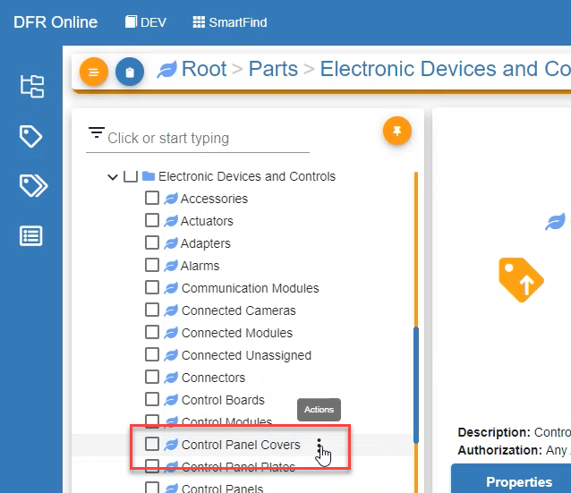
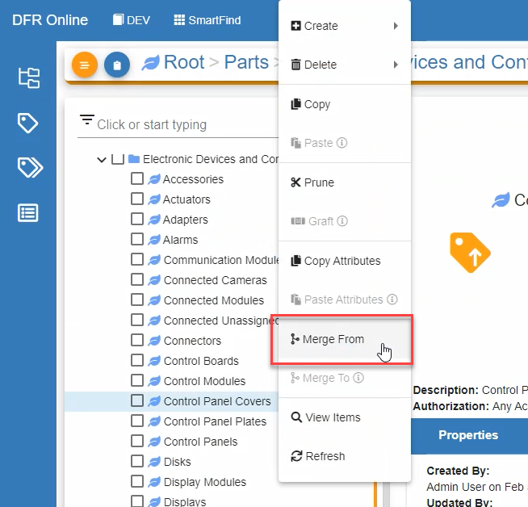
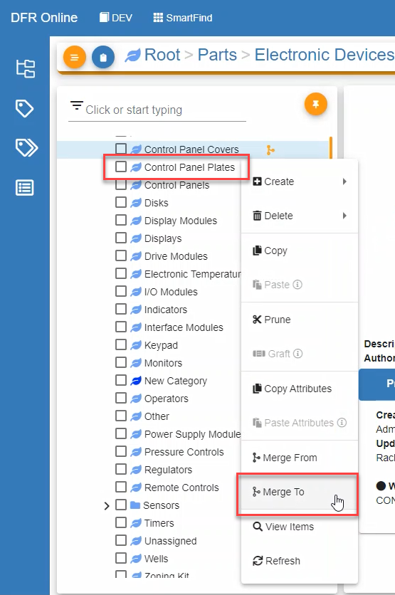
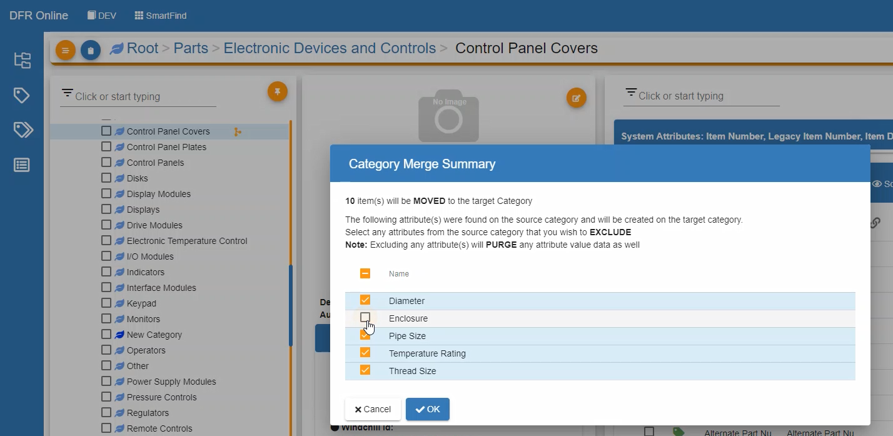
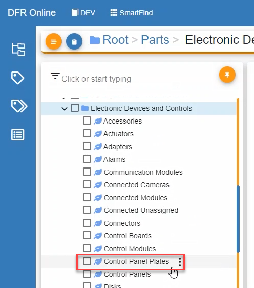

# Merge Categories

Merge\_Categories - Design For Retrieval (DFR) Help

## Merge Categories

Categories can be merged together in the SmartClass module. This feature is available to users with permission to perform this action. With this feature, a user can select a leaf node category to merge from and a leaf node category to move to. This brings over all items and selected attributes from the originating category that did not exist in the destination category. The destination category name remains the same.

&#x20;

In order to merge two categories:

1. Navigate to Classification Manager
2. Click on Actions to the right of the category that you are merging (_i.e. the originating category_)

3. Click on Merge From (_a merge selection icon will appear next to Actions)_

4. Click on Actions to the right of the category that you are merging to (_i.e. the destination category_)
5. Click on Merge To

6. De-select any attributes that you do not want to add to the new category (_Note: This purges any values associated with that attribute in the original category_)

7. Click OK

&#x20;

After merging the categories, all attributes from the originating and destination categories will be under one node, keeping the name of the destination category. The originating category is no longer available.

