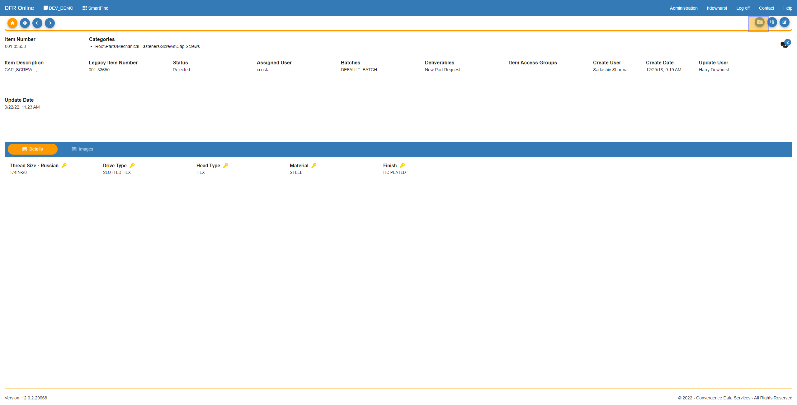
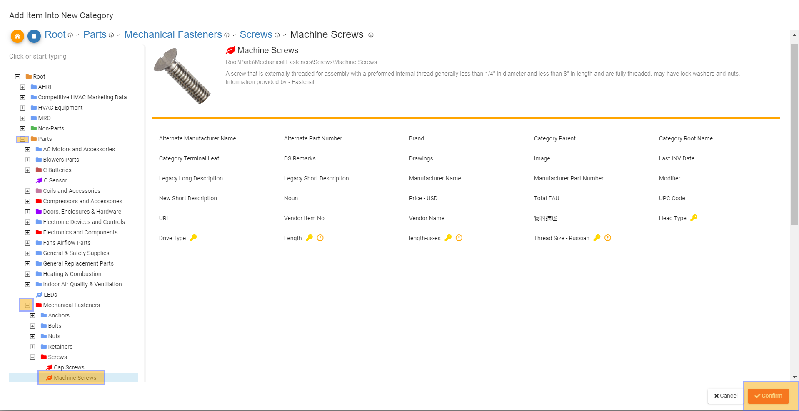
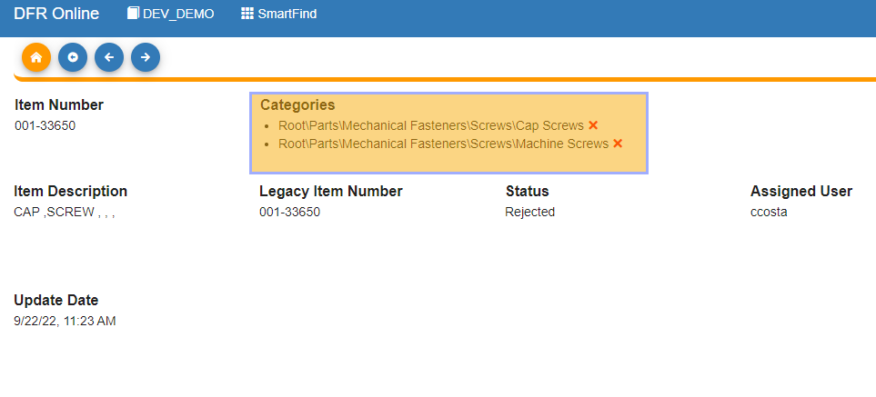

MultiClassify - Design For Retrieval (DFR) Help

# Multi-Classify

 

If you would like to have an item be in multiple categories at the same time, you can Multi-Classify an item. 

 

Navigate to the item you would like to multi-classify in SmartFind.

  

In the top right of your screen, click the button with folder on it highlighted below.

 

 

 

Now in the pop-up window, drill down to the category you would like to add the item to. 

 

Click on the category and click confirm in the bottom right. 

 

 

 

Now you will see the categories that the item is classified in. You can click the red "x" next to the categories to de-classify the item from that category. 

 

 

 

 

 

 

