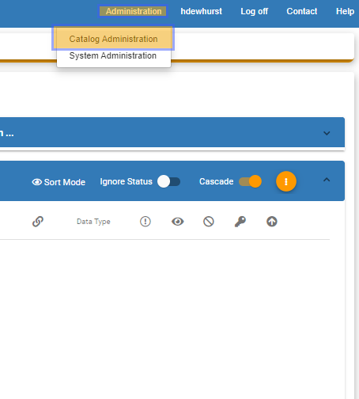
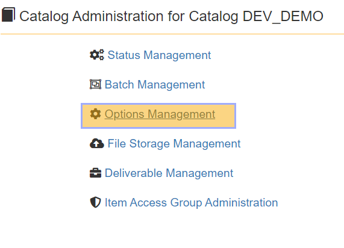
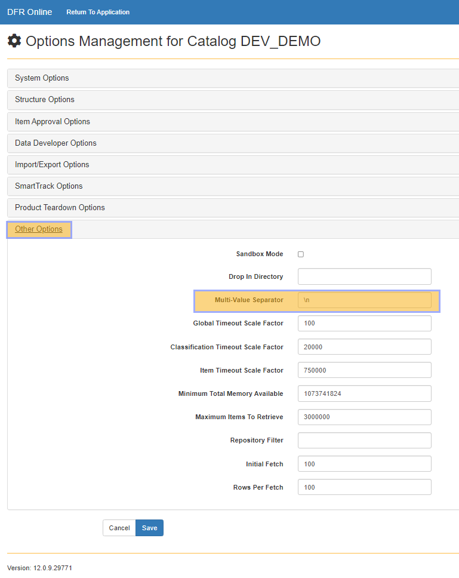
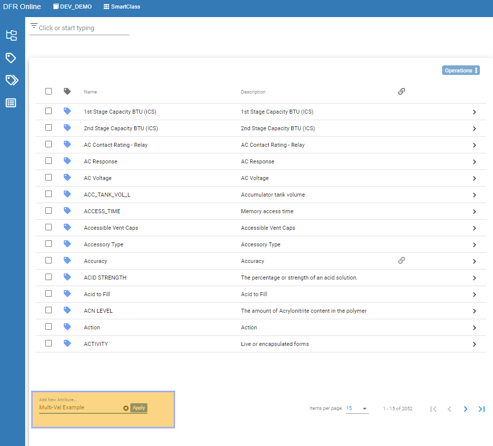
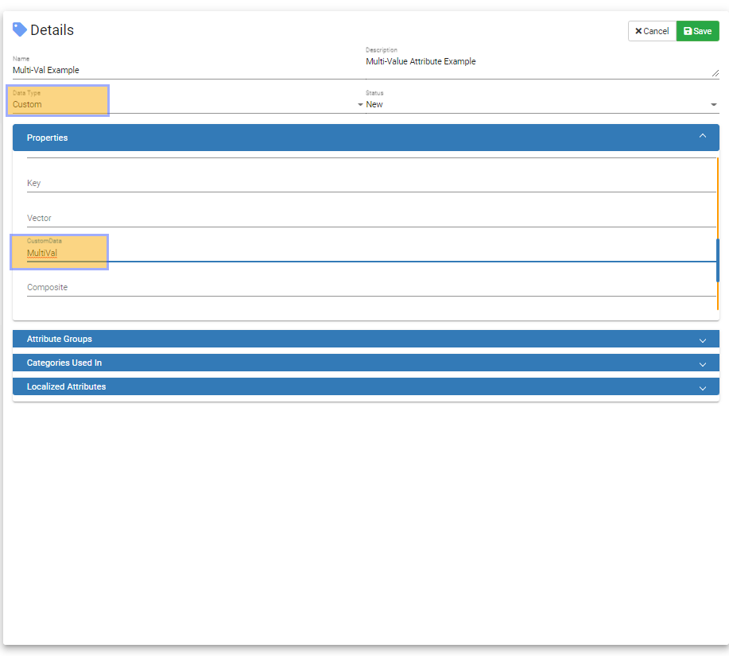
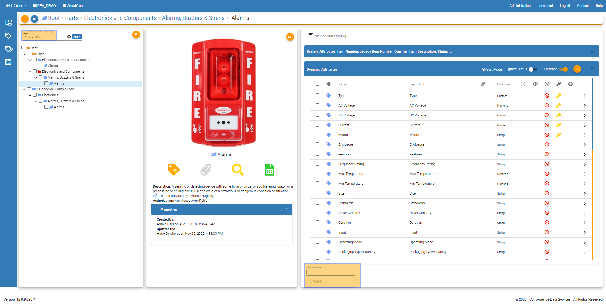
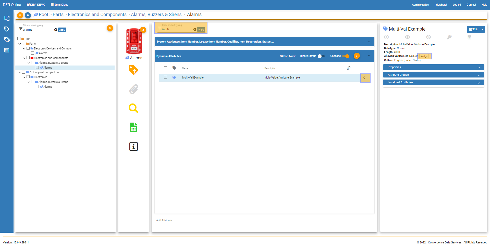
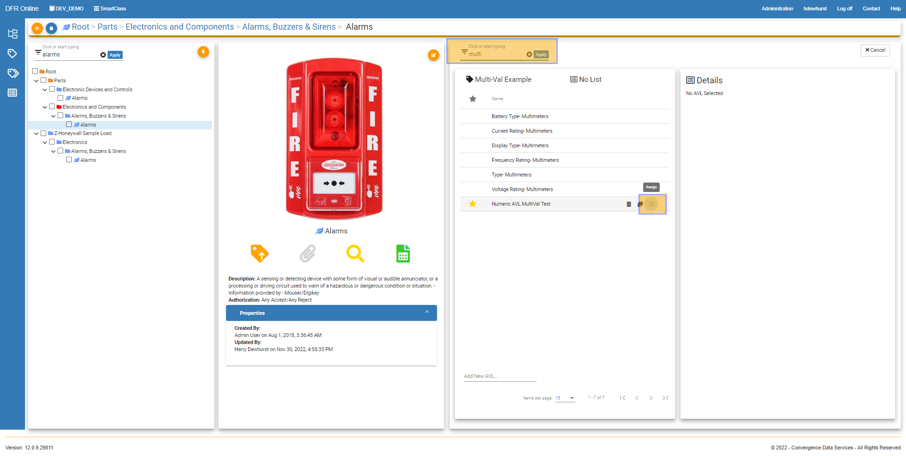
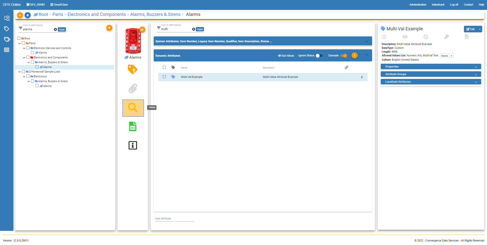
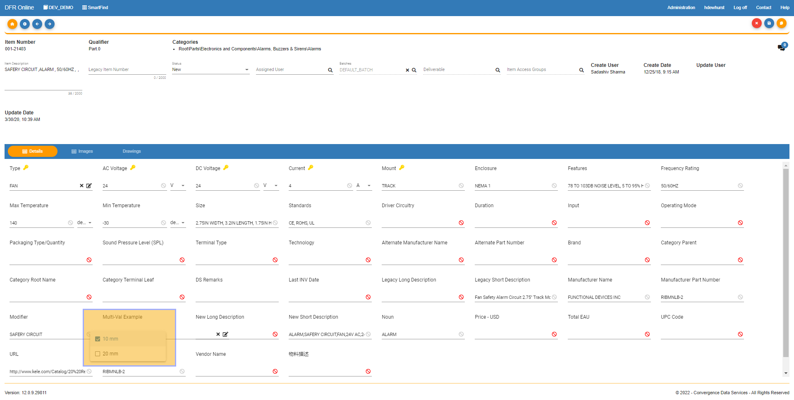

MultiValue\_Attributes - Design For Retrieval (DFR) Help

# Multi-Value Attributes

 

A multi-value attribute is an attribute that has the ability to hold more than one attribute at the same time delimited by the character of your choice. This page will walk you through how to set up, modify, and access multival attributes.

 

1.  Open Convergence PIM and click on Administration on the top right navigation bar, and click Catalog Administration. 

2. Then we can click on Options Management

 

3. Now we can expand Other Options and take a look at the Multi-Value Separator field.  In this example, you can see that there is a \n in the field as the separator. This is a new line separator so between all the values, when exported the values will be on separate lines. You can make this value whatever you would like such as a ";", ",", "/". (Semicolon, comma, or forward slash). Whatever separator you enter here in the settings here will be used when exporting attribute data. 

 

Click Save to save your changes and you have completed this section. 

 

 

 

4. Now navigate to SmartClass, and click on the attributes tab on the left-hand navigation. At the bottom left you can add a new attribute. Type the name of the new multi-val attribute you would like to add. 

 

 

5. Now fill in the fields you desire. Under the Data Type field, choose Custom. Then expand the properties field, scroll down a bit and in the Custom Data field enter "MultiVal" exactly like this, in that field. 

 

 

 

6. Now you can assign the MultiVal attribute you just created to a category. Go to SmartClass, drill down to your desired category and type in the attribute name in the "Add Attribute" field. 

 

 

7. Now assign an allowed values list to the attribute. Search for the attribute you just added in the dynamic attributes for this category. Click the carrot all the way to the right. Click on Assign to assign an allowed values list. 

 

 

8.  Search for your desired allowed values list and click assign. 

 

 

9. You have successfully completed creating and assigning an allowed values list to a MultiVal attribute. To check that it worked correctly, from the category you just added the attribute to in SmartClass, click on the magnifying glass to bring you to the items page. 

 

 

10. Click on an item in the category and in the top right of your screen, click edit. Now you can click on your multival attribute you created and you can choose from the allowed values list that you assigned to it. 

 

 

