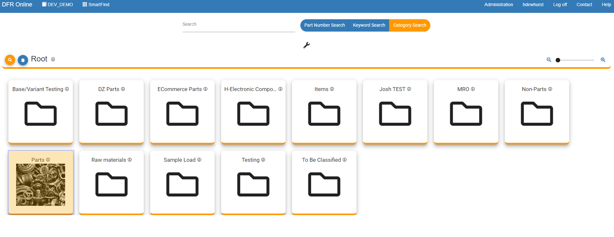
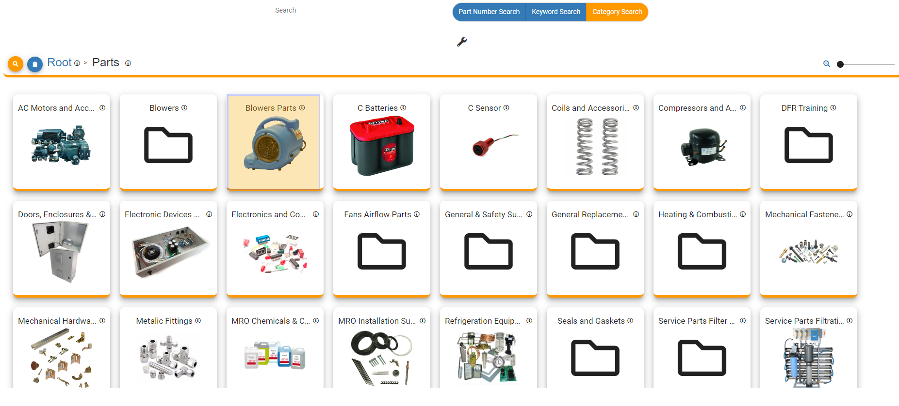
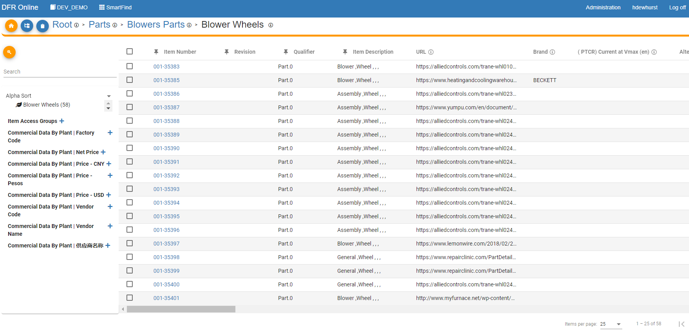
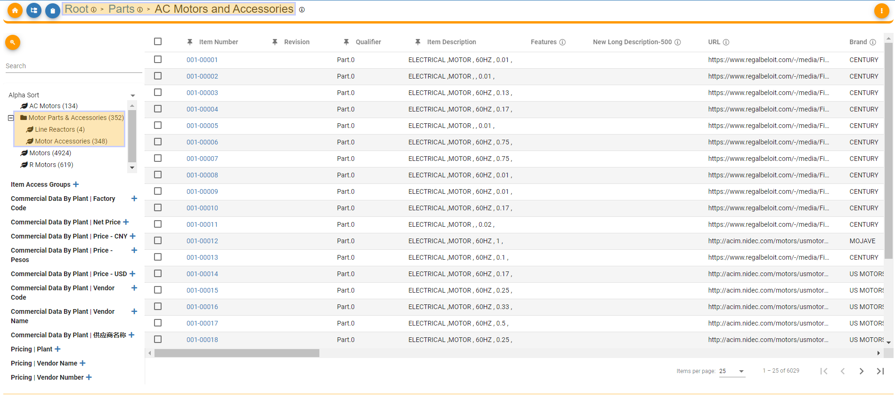

Navigate\_Structure\_Data - Design For Retrieval (DFR) Help

# Navigate Structure Data

Searching for parts can be done by Image.

 

To search by Image, simply click on any Image.

In this example, Parts image is selected.  

 

 

Now you can see the subcategories under the selected Image. Click on the next Image.

In this example, Blower Parts is selected.  

 

 

Now, all parts are shown in SmartFind. This means that there are no more categories under the last selected image. In this example, there was another sub category below

Blower Parts, called Blower Wheels.  

 

 

 

Now, all parts are displayed in SmartFind. Also, you can see that there are more subcategories under the selected Category Name.  

 

