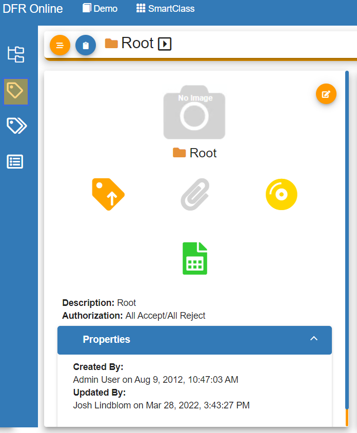

# Remove Attributes

Remove\_Attributes - Design For Retrieval (DFR) Help

## Remove Attributes

If you would like to remove attributes, please first navigate to SmartClass.

&#x20;

First, click on the price tag icon on the left-hand side of your screen.

&#x20;

&#x20;

Now find the attribute you would like to remove and click the trash can button to delete the attribute

&#x20;

&#x20;

You have now successfully removed an attribute.

&#x20;

&#x20;

&#x20;

&#x20;

&#x20;

&#x20;

&#x20;

&#x20;

&#x20;
