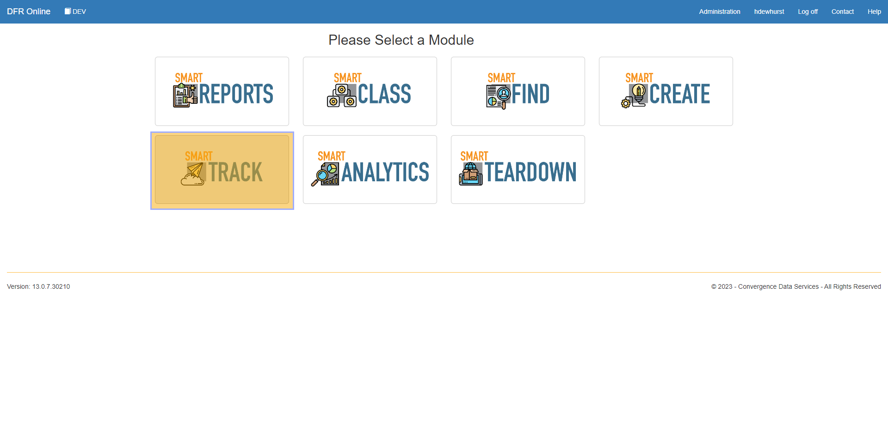
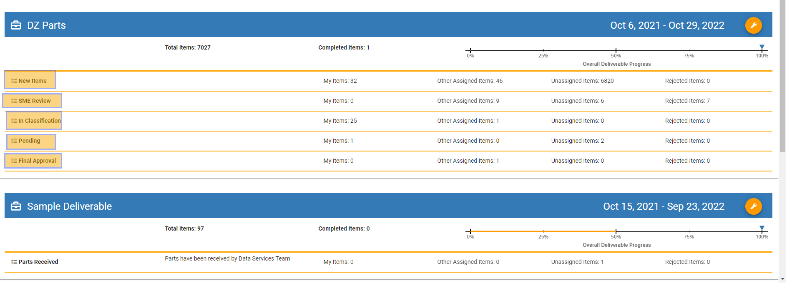
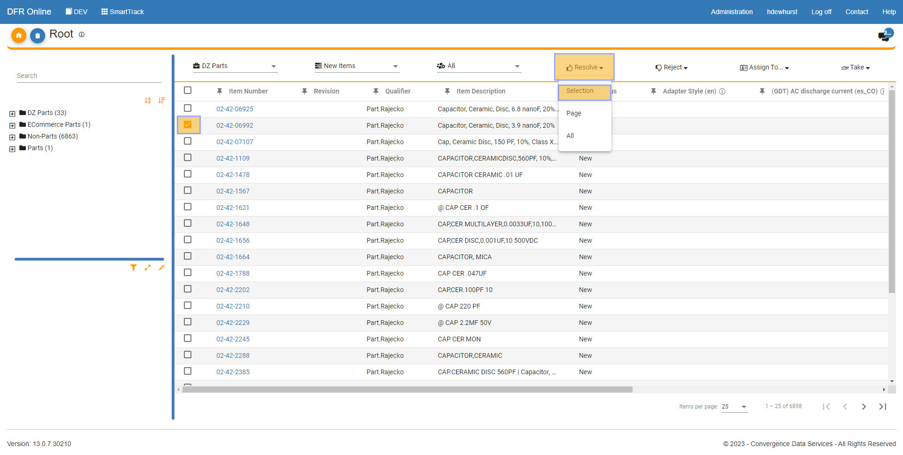
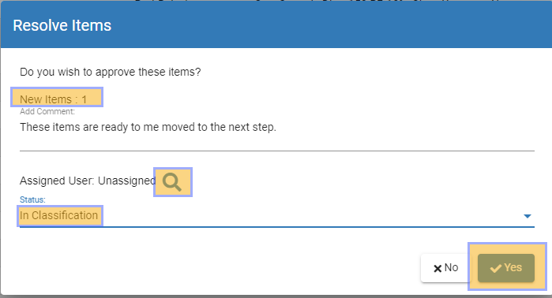
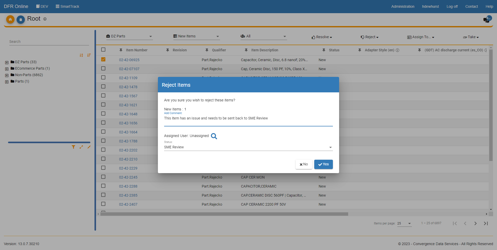

Resolving\_or\_Rejecting\_Parts - Design For Retrieval (DFR) Help

 

# Resolving or Rejecting Parts

Welcome to the SmartTrack documentation page. As a part of the CDS PIM suite, SmartTrack provides a user-friendly platform to approve or reject parts in real-time. This module is designed to streamline the approval process and improve efficiency by allowing users to quickly access and manage parts information. With SmartTrack, you have the ability to resolve or reject parts with just a few clicks, ensuring that your organization's quality control standards are upheld. This page will guide you through the process of using SmartTrack to manage your parts approvals.

 

 

1. Log in to SmartTrack: To access the SmartTrack module, log in to your Convergence Data Services account. Click on the SmartTrack module.

 

2. View deliverables and tasks: From the dashboard, you will see the list of all of the active deliverables. Click on one of the tasks within a deliverable and you will be taken to that task's items. If you look in the same row as the different tasks you can see how many items are within each task. 

3. Within a task you will now see all the items that are assigned to the task.  When an item is being reviewed, it is ready to be moved to the next task then it can be resolved. If something is wrong, and it needs to be moved back a task then it can be rejected. 

 

To resolve a part, click the square box for the part that you want to select.  Then hover over the "Resolve" button at the top of the screen and you can pick one of three things. 

- Selection - Will only resolved the items that you selected (click the items' corresponding box)
- Page - Will resolve all of the items that are currently being shown on the page
- All - Will resolve all of the items that are assigned to the task.

 

 

 

4.  At the top of the pop up you can see how many items you are about to resolve. You can write a comment for the resolution as well as assign the part/parts to a new person when you are moving them. Finally, you have to choose a new status for the items so they will end up in a new task.  When you have filled out all of the fields, click "Yes" and your items will be resolved. 

 

 

5. Rejecting items is the exact same process except a slightly different button. When you have nagivated to the items that are in a task you can select the items that you want to reject and then click the "Reject" button at the top of the screen.  Fill out all of the fields like when Resolving a part and then click "Yes", you will have just rejected the items you selected. 

 

 

