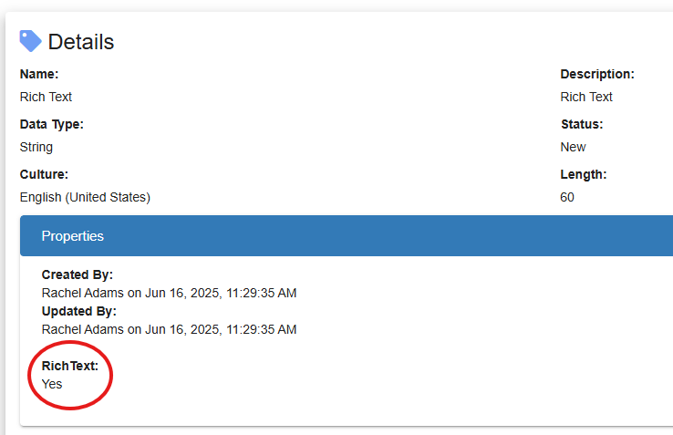
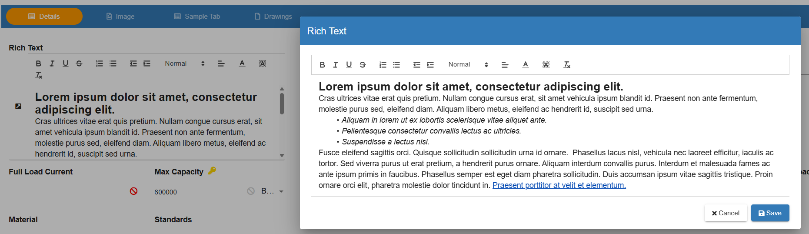

# Rich Text Attributes

Rich\_Text\_Attributes - Design For Retrieval (DFR) Help

## Rich Text Attributes

&#x20;

A **rich text field** is a type of input or data field that allows users to format text using styles such as bold, italics, lists, links, et al. rather than just plain text. A string attribute can be updated to become a Rich Text editable field by updating the properties on the attribute to show RichText=Yes.

&#x20;

A user is then able to edit the attribute and format the text in Item Details as needed.

&#x20;

&#x20;
