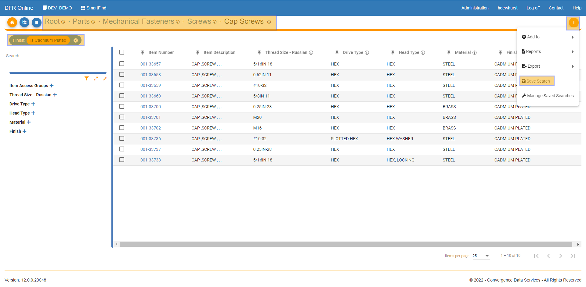
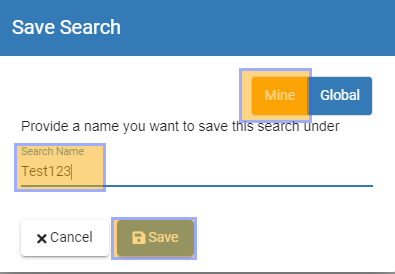
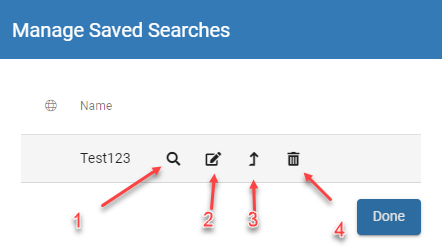

# Saved Search

Saved\_Search - Design For Retrieval (DFR) Help

&#x20;

## Saved Search

&#x20;

\*\*Saved searches are managed with permissions. If you do not see the options to manage saved searches and you think you should, then please contact your system administrator.\*\*

&#x20;

To save a search (and filters) that you have created in SmartFind you can create saved searches.&#x20;

&#x20;

To do this, you can first create a search and filter the parts in that search.&#x20;

&#x20;

Click on the orange button in the top right of the screen and click "Save Search"

&#x20;

&#x20;

You must then name your search and choose if you would like it to be saved locally or globally.&#x20;

Locally means that only you can see and edit the saved search, where globally means anyone in your organization can see and edit the saved search.&#x20;

&#x20;

Once you have named and chosen mine or global, click save to save the search for future use.&#x20;

&#x20;

&#x20;

Now when you click the "Home" button on the top left of your screen you can see and manage all of your saved searches.&#x20;

&#x20;

Highlighted below you can see the saved search you just created as well as a wrench icon.&#x20;

&#x20;

If you click the saved search that you just made you can see that it will take you right back to the exact category and filters that you had previously made.&#x20;

&#x20;

&#x20;

If you click the wrench icon, you can "manage" your saved searches.&#x20;

&#x20;

1. Search - Click this icon and it will take you to the search.&#x20;
2. Edit - Click this icon and you can edit the name of the saved search.&#x20;
3. Promote - Click this icon if you would like to make a local saved search a global one. Note: if you have a global saved search, you will see a "globe" icon to the left of the name of the saved search.&#x20;
4. Delete - This will delete the saved search. Be careful it will immediately delete the saved search and you will not be able to get it back.&#x20;

&#x20;

&#x20;

&#x20;
