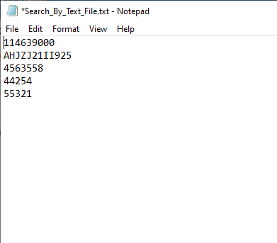
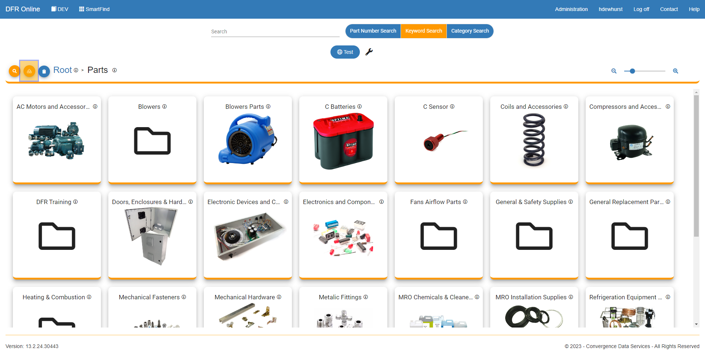

Search\_by\_Text\_File - Design For Retrieval (DFR) Help

# Search by Text File

 

1. To first search using a text file, please create a .txt file that contains a list of part numbers that you would like to search for.  The item numbers must be separated, with one being on each line as shown below. 

 

 

 

2. Once you have made your text file, navigate to SmartFind. On the home page of the module you will see a button in the top left of the screen, shown below. Click on it to upload your file. 

 

 

3. Browse for the text file that you created in step 1 of this help page. Once selected, you will see that the parts that you entered into the text file will be shown.

 

 

