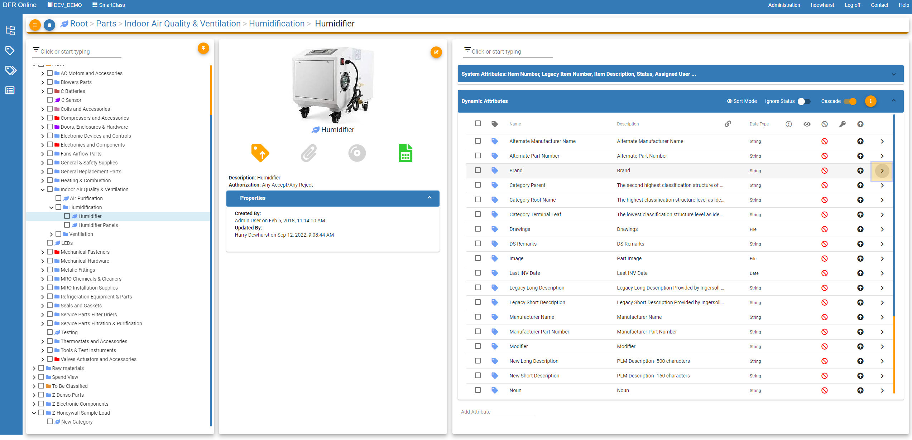
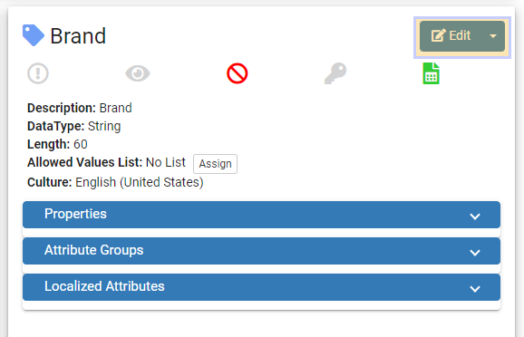
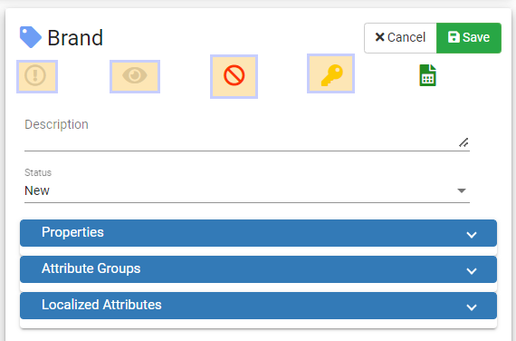

Set\_Attributes\_as\_Key\_Required\_DNA\_and\_Read\_Only - Design For Retrieval (DFR) Help

# Set Attributes as Key, Required, DNA, and Read Only

 

 

First navigate to SmartClass and click the orange "Category Tree" button in the top left. 

 

 

 

Now you can click the orange "thumbtack" button to pin the tree on the page. 

 

Then drill down to the category you would like to change the attribute features. 

 

 

Find the attribute that you would like to edit and click on the arrow button on the far right of the attribute shown below. 

 

Now in this window click the blue Edit button

 

You can now click the greyed out icons to enable the feature or click the colored icons to disable the feature. 

 

The circle with the exclamation inside is Required: This means the attribute is required to have a value. 

The eye icon is Read Only: This means no one except for system admin can edit this attribute.  

The circle with the cross through it is DNA (Does Not Apply): DNA means that this attribute does not apply to this specific category. 

The key icon is Key: This means that the attribute is important (this is usually used for filtering purposes).

 

 

To finish editing your attribute you can click the green save button to save your progress. 

