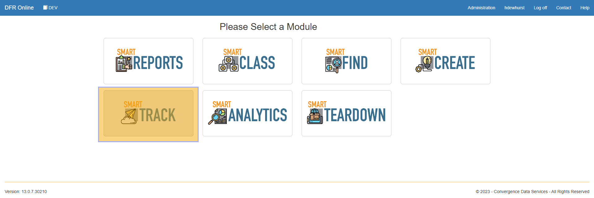
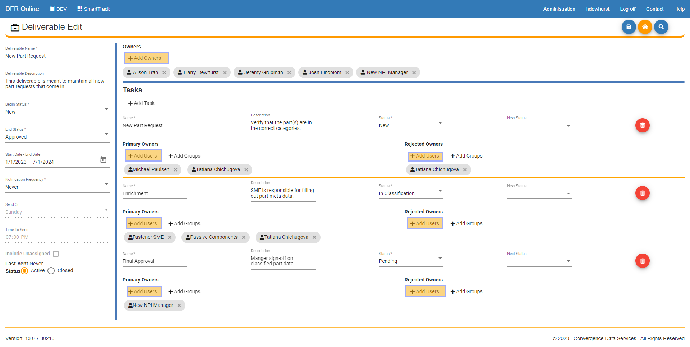
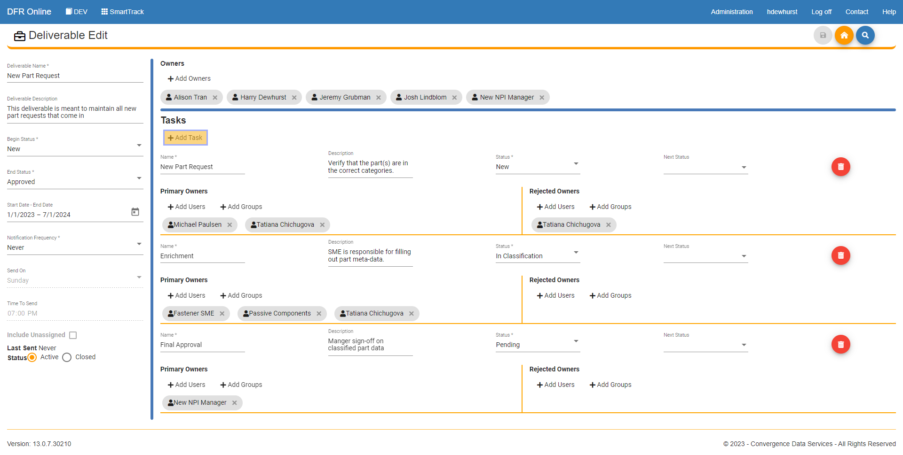
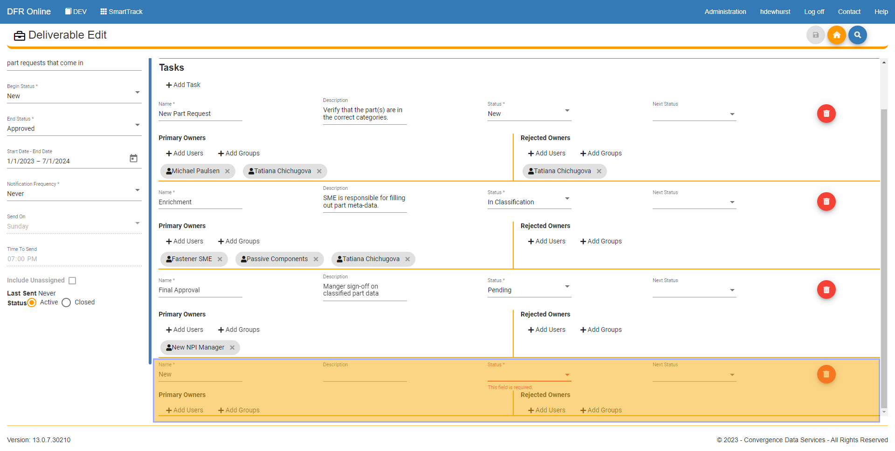

Set\_Up\_Owners\_and\_Tasks\_for\_a\_Deliverable - Design For Retrieval (DFR) Help

 

# Set up Owners and Tasks for a Deliverable

 

Welcome to the documentation page for Convergence Data's SmartTrack module, where we will be discussing how to set up owners and tasks for a deliverable. Deliverable management is an essential part of project management, and SmartTrack is designed to simplify the process of assigning ownership and tracking progress. With SmartTrack's powerful task management features, project managers can easily assign tasks to team members, set deadlines, and track progress in real-time. This documentation will provide you with a comprehensive guide on how to set up owners and tasks for your deliverables using SmartTrack, and how to leverage the module's capabilities to enhance collaboration, improve visibility, and achieve project success. Whether you're a project manager or a team member tasked with completing deliverables, this documentation will equip you with the knowledge and tools you need to get the job done efficiently and effectively. Let's get started!

 

 

1. Log in to SmartTrack: To access the SmartTrack module, log in to your Convergence Data Services account. Then click on the SmartTrack module to get started.

 

 

2. Edit a deliverable: From the dashboard, click on the "Wrench" icon on one of the deliverables you have made. You will then see many different areas to add and remove owners. 

- Add owners to the deliverable by clicking the "Add Owners" close to the top of the page.
- Add primary owners to a task. This is someone who will be working with the items for that task.
- Add rejected owners to a task. This is someone who will be working with the items that are rejected within a task.

 

 

3. Add Tasks To a Deliverable: In the Manage Deliverable page you are still in you can add a task by clicking the "Add Task" button. 

 

 

 

When the "Add Task" button is clicked it will add a new task line at the bottom of the task list (you may need to scroll down). Fill out the required fields, add primary and rejected, users and groups, and then click Save in the top right of your screen. 

 

 

 

 

You have sucessfully added users and tasks for a deliverable. 

