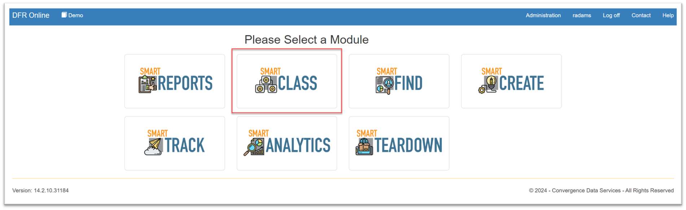

# SmartClass

SmartClass - Design For Retrieval (DFR) Help

## SmartClass

**SmartClass** is the Convergence PIM module where all updates related to the data model are performed, including changes to:

* Category structure/schema
* Attributes
* Attribute groups
* Allowed Values Lists (AVLs)

&#x20;

Click on the SmartClass icon to access the module.

&#x20;

&#x20;

**SmartClass Functions**

On the left-hand side of the page, there are 4 icons that allow you to change what part of SmartClass you are working in.

&#x20;

&#x20;The folders icon is for **Classification/Schema** and is where you can view the category tree.

&#x20;The single tag icon is the **Attribute**library, where you manage all attributes for this catalog.

&#x20;The multiple tags icon is the **Attribute Group** library, where attribute groups can be created and attributes can be assigned to groups.

&#x20;The bulleted list icon is the **Allowed Values List**library, where you can manage and assign legal values for attributes.

&#x20;

&#x20;

Click on the links below to access the following pages:

* [**Classification**](smartclass.md)
  * [Structure](smartclass.md)
    * [Navigate Classification Structure](smartclass.md)
    * [Category Management](smartclass.md)
      * [Copy and Paste Categories](copy-and-paste-categories/)
      * [Add New Categories](smartclass.md)
        * [Add New Parts Categories](smartclass.md)
        * [Add New File Categories](smartclass.md)
      * [Edit Categories](smartclass.md)
        * [Edit Category Properties](smartclass.md)
        * [Edit Category Details](smartclass.md)
      * [Delete Category](smartclass.md)
      * [Route from Categories to Items](smartclass.md)
      * [Add Category Attachments](smartclass.md)
      * [Add Category Images](smartclass.md)
      * [Assign Allowed Vales Lists](smartclass.md)
  * [Attributes](smartclass.md)
    * [Edit Attribute Details](smartclass.md)
    * [Set Attributes as Key, Required, DNA, and Read Only](setattributefeatures/)
    * [System Attributes](smartclass.md)
* [**Attributes(Master Attributes)**](smartclass.md)
  * [Create New Attributes(Master Attributes)](smartclass.md)
  * [Delete Attributes](smartclass.md)[(Master Attributes)](smartclass.md)
  * [Localized Attributes](smartclass.md)
* [**Attribute Groups**](smartclass.md)
  * [Create and Delete Attribute Groups](smartclass.md)
* [**Allowed Values**](smartclass.md)
  * [Create Allowed Values Lists](smartclass.md)
  * [Edit Allowed Values Lists](smartclass.md)
    * [Add Values Manually & Suggested Values](smartclass.md)
    * [Load Values from a Text File](smartclass.md)
    * [Sort Values](smartclass.md)

&#x20;
