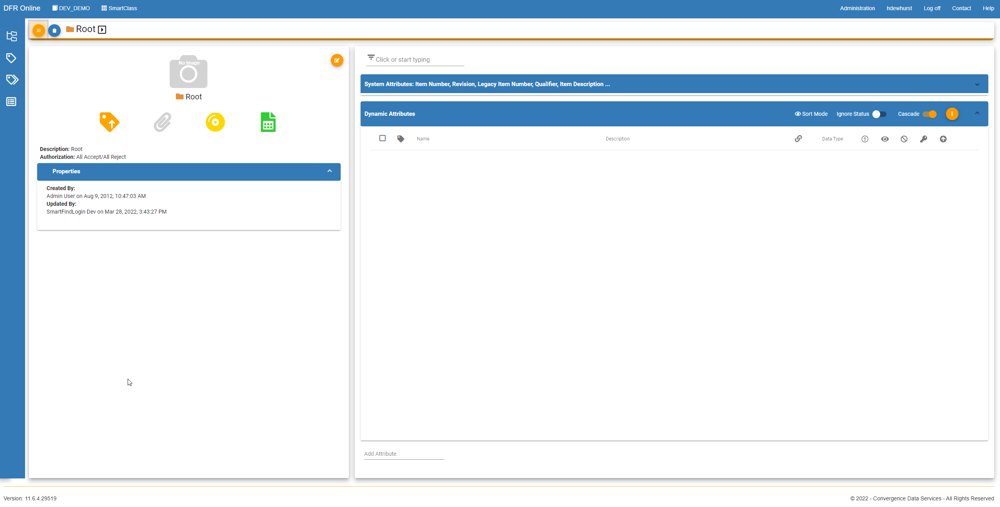
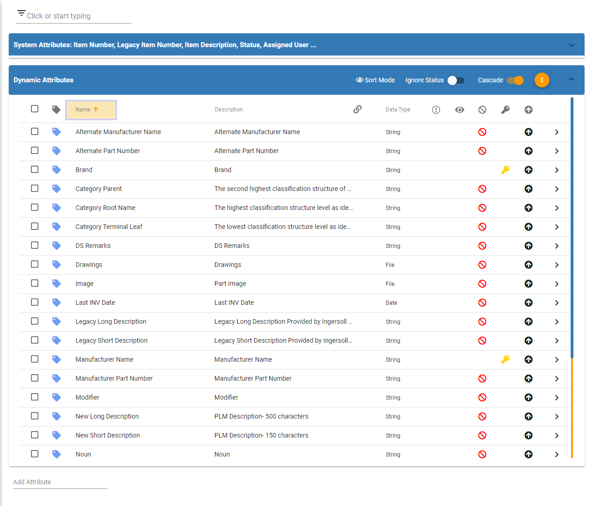
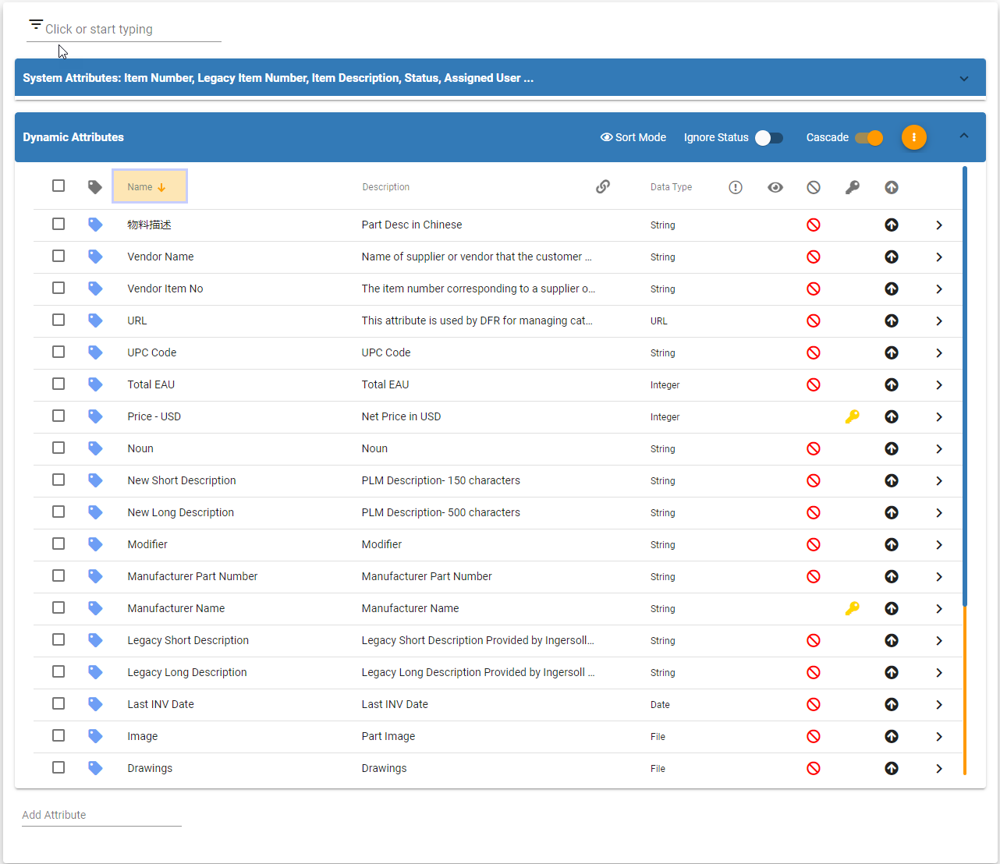
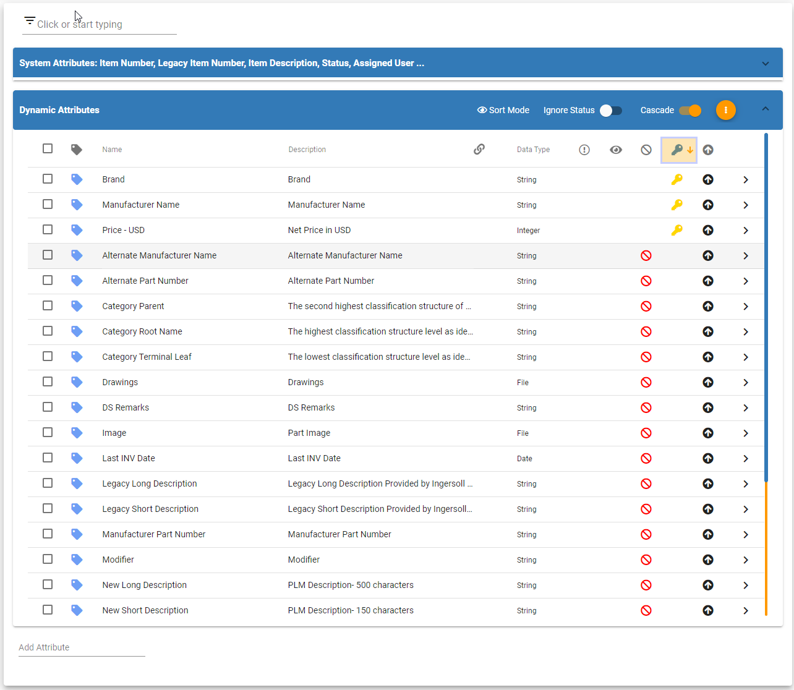

# Sort Attributes

Sort\_Attributes - Design For Retrieval (DFR) Help

## Sort Attributes

&#x20;

Navigate to SmartClass and click the orange button called "Category Tree"&#x20;

&#x20;

&#x20;

Now you can click the orange "thumbtack" button to pin the tree on the page.&#x20;

&#x20;

Then drill down to the category that you would like to sort attributes in.

&#x20;

&#x20;

&#x20;

&#x20;You can sort by the column headers by clicking on the column headers. In this case, I clicked Name and it is sorted in alphabetical order from A-Z.&#x20;

&#x20;

&#x20;

To reverse the sort order, click the column header name again. You can see the attributes are now sorted by Name from Z-A.&#x20;

&#x20;

&#x20;

Another example is sorting by whether attributes are denoted as key.

&#x20;

&#x20;

&#x20;

You can remove the sorting from the attributes by clicking the column header until the small arrow next to the header is gone.&#x20;
