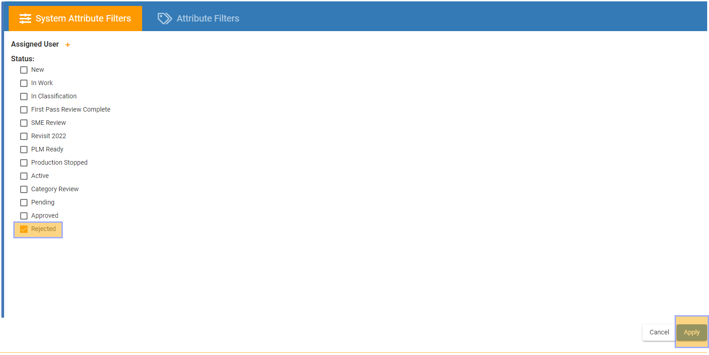
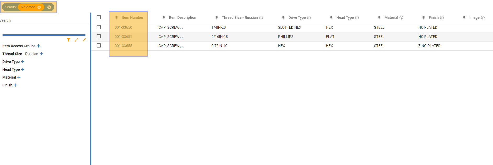

Status\_Filtering - Design For Retrieval (DFR) Help

# Status Filtering

 

Navigate to SmartFind and drill into a category where you would like to view and access parts. 

 

Click on the Funnel icon highlighted below and this will take you to SmartFind Advanced Filtering. 

 

 

 

The Advanced Filtering Menu comes up and you can choose, System Attribute Filters or Attribute Filters. Let's start with system attribute filters, under this set of filters you can filter by assigned user or by item status. 

 

 

 

Click one of the statuses in the list to filter by that status. In this case, I am going to filter by all items with the "Rejected" status. 

 

Click the check box next to the "Rejected" status, and click the "Apply" button in the bottom right of the screen to apply the filters. 

 

Note: You can select multiple statuses to filter at the same time. 

 

 

 

It is shown below that the filter for all rejected items in this category is active and the items show up on the right in the list. 

 

 

 

 

