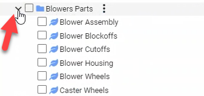

Structure - Design For Retrieval (DFR) Help

# Category Structure

The category tree follows a typical folder structure. Categories are divided into parent categories, child categories, and leaf nodes.

 

 .png)

 

Clicking on the arrow next to a parent category name will expand any child categories beneath.

 

 Leaf node (designated with the leaf icon

) 

 

 

 

Click on the links below to access the following pages:

- [Navigate Classification Structure](#)
- [Category Management](#)
	- [Copy and Paste Categories](#)
	- [Add New Categories](#)
		- [Add New Parts Categories](#)
		- [Add New File Categories](#)
	- [Edit Categories](#)
		- [Edit Category Properties](#)
		- [Edit Category Details](#)
	- [Delete Category](#)
	- [Add Category Attachments](#)
	- [Add Category Images](#)
	- [Assign Allowed Vales Lists](#)

