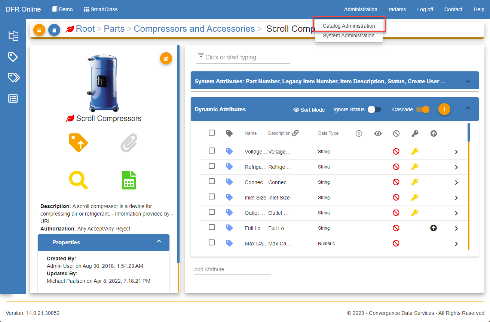
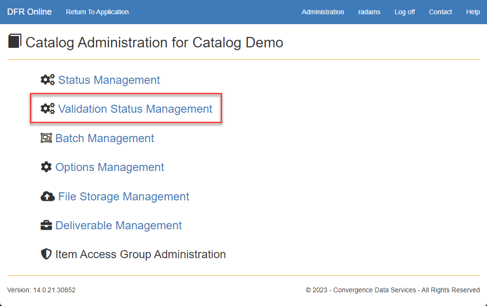
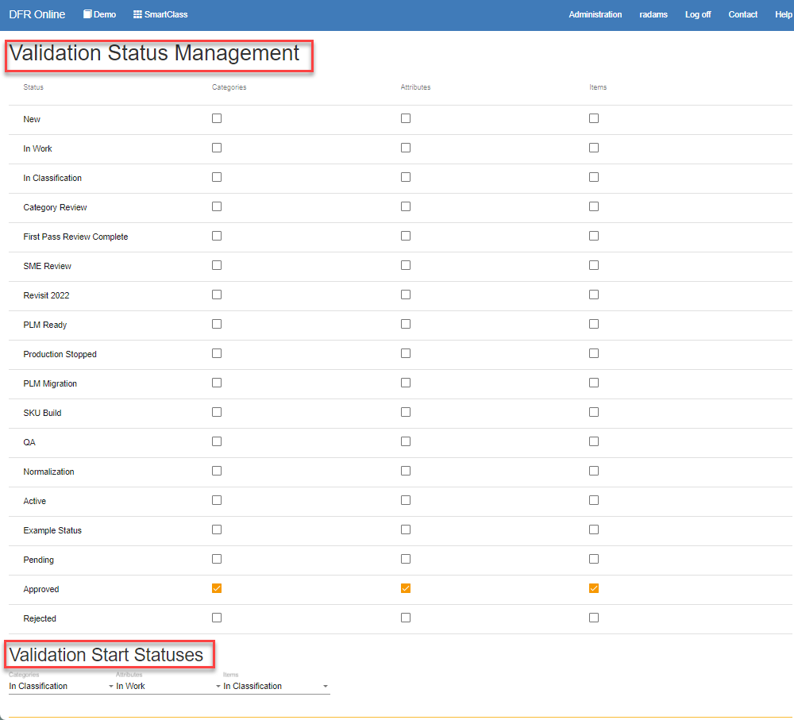

Validation\_Status\_Management - Design For Retrieval (DFR) Help

# Validation Status Management

Validations occur when a category, attribute, or item reaches a selected status. Users are also unable to move a category, attribute, or item to the next status when violations are present as defined in Catalog Management.

 

1. Locate the Catalog Management tab under Administration. 

 

2. Select Validation Status Management

- Validation Status Management
	- Columns of checkboxes for Categories, Attributes, and Items for each status. Only one box per column can be selected. These selections indicate at which status something cannot be promoted to the next status when there are validation errors present.
- Validation Start Statuses
	- Dropdowns for Categories, Attributes, and Items with options for each status. These selections indicate at which status CDS PIM will start validating the data. This does not impact whether or not something is allowed to be promoted to the next status.

