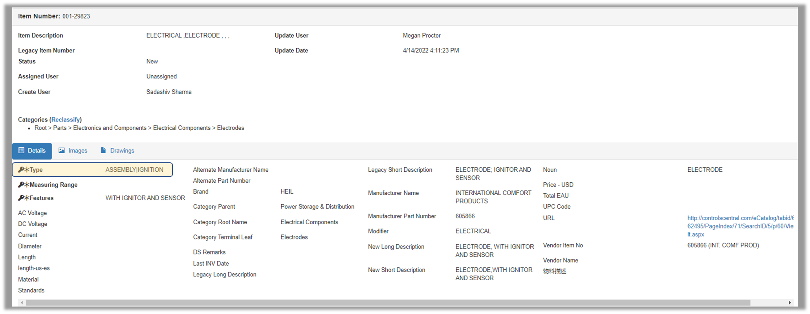

View\_Items\_with\_MultiVals - Design For Retrieval (DFR) Help

# View Items with MultiVals

Multiple values can be displayed on the thick client. In Data Developer, you can see all items where multiple values are stored.

 

In the thick client, go to Data Developer and select a category where the MultiVal attribute is available.

.png)

 

Click on the category to display all items. 

There you can see multiple values under the MultiVal attribute.

Note that the count of the number of values is first shown followed by ':', then the values are displayed and separated by '|'
.png)

 

CDS PIM Online will also display multi-values on the Item Details page. 

This feature is not yet visible on the main results page.

 

 

